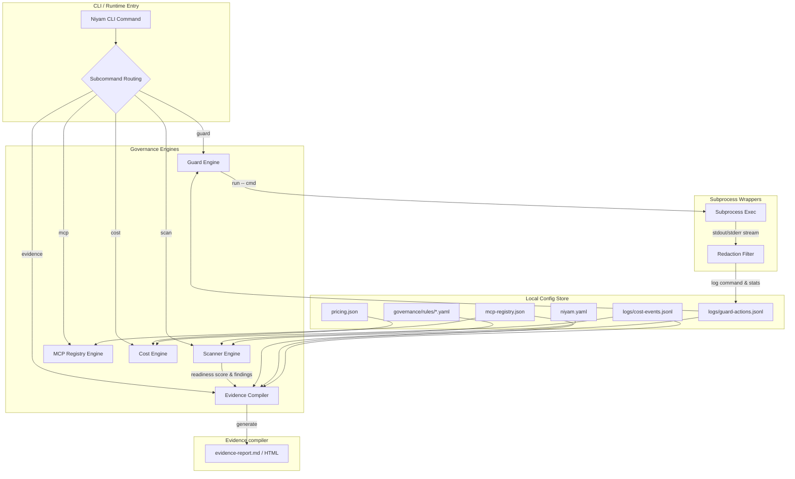

# Technical Architecture: Niyam Governance Suite

## 1. System Architecture Design
The Niyam Governance Suite consists of five local-first engines. All operations run within the user's terminal session, reading from and writing to the local `.niyam/` configuration store.



---

## 2. Local Data Schemas & Models

### A. `.niyam/niyam.yaml`
Extends the core Niyam configuration file with governance parameters:

```yaml
version: 0.1.0
project_name: my-governed-app
profile: team                  # startup | team | enterprise
runtimes:
  - claude
guard:
  enabled: true
  careful: true                # Warn on destructive shell commands
  frozen_paths:                # Read-only paths blocked from agent modifications
    - niyam/governance
    - tests/
```

### B. `.niyam/mcp-registry.json`
Catalogs all tools and MCP servers authorized for AI consumption.

```json
{
  "schema_version": "1.0.0",
  "tools": {
    "local-filesystem": {
      "name": "local-filesystem",
      "type": "mcp_server",
      "command_or_url": "npx -y @modelcontextprotocol/server-filesystem /path/to/project",
      "owner": "Security Team",
      "risk_level": "high",
      "approved": true,
      "capabilities": ["read_file", "write_file", "list_dir"],
      "data_access": "Project workspace directories",
      "notes": "Allows AI read/write modifications to project files"
    }
  }
}
```

### C. `.niyam/pricing.json`
Local rates matrix mapped by vendor model names, representing cost in USD per 1,000,000 tokens.

```json
{
  "claude-3-5-sonnet": {
    "input_cost_per_million": 3.00,
    "output_cost_per_million": 15.00
  },
  "gpt-4o": {
    "input_cost_per_million": 5.00,
    "output_cost_per_million": 15.00
  },
  "gemini-1.5-pro": {
    "input_cost_per_million": 1.25,
    "output_cost_per_million": 5.00
  }
}
```

### D. `.niyam/logs/guard-actions.jsonl`
Append-only log recording actions executed under `niyam guard run`.

```json
{"timestamp": "2026-06-04T12:00:00Z", "session_id": "session-xyz", "actor_type": "agent", "tool": "shell", "action": "command_execute", "command": "npm run test", "cwd": "/project/sutra", "exit_code": 0, "duration_ms": 1450, "mode": "observe"}
```

### E. `.niyam/logs/cost-events.jsonl`
Append-only ledger of token usage and calculated session pricing.

```json
{"timestamp": "2026-06-04T12:00:00Z", "session_id": "session-xyz", "task_id": "T1-governance-spec", "tool_name": "claude-code", "model": "claude-3-5-sonnet", "input_tokens": 12500, "output_tokens": 2400, "estimated_cost": 0.0735, "repo": "sutra", "branch": "feature/governance", "status": "success", "notes": "initial doc generation"}
```

---

## 3. Rule Engine & Deductions Design
The scanner uses 7 core match types against file systems and text streams:

1. **`file_exists`**: True if path matches any declared filenames.
2. **`file_missing`**: True if path does not match any declared filenames.
3. **`filename_pattern`**: Evaluates unix globs (e.g. `*.key`, `.env.*`).
4. **`directory_exists`**: True if folder directory is present.
5. **`directory_missing`**: True if folder directory is absent.
6. **`content_contains`**: True if files contains literal substring.
7. **`content_regex`**: Evaluates case-insensitive standard regular expressions.

### Score Deductions Table
Calculates score $S = 100 - \sum \text{Deductions}$, bound between $0$ and $100$:

| Severity | Score Deduction | Mitigation Action Required |
| --- | --- | --- |
| `critical` | 25 | Immediate remediation; block build gate. |
| `high` | 15 | Remediation required; block enterprise launch. |
| `medium` | 8 | Action suggested; warning raised. |
| `low` | 3 | Minor note; info raised. |
| `info` | 0 | None. |

---

## 4. CLI Implementation Specification
Built using `Typer` and structured inside `niyam/cli/`. Renders rich formatting to standard output using the `rich` library.

### Key Command Classes
* **`scan.py`**: Executes the directory checker logic and generates CLI panels showing findings.
* **`guard.py`**: Interacts with the policy parameters, active freeze configurations, and subprocess wrappers.
* **`mcp.py`**: Commands for inserting, editing, and mapping risk thresholds for tools.
* **`cost.py`**: Subcommands for query summaries and generating table formatting.
* **`evidence.py`**: Renders templates via `Jinja2` to markdown/HTML reports.

---

## 5. Subprocess Hook Mechanics
When executing commands via `niyam guard run -- <command>`, the execution wraps the target shell script safely:

1. **Context Capturing:** Retrieves environment vars, active path configurations, and current git state.
2. **Execution:** Invokes standard Python `subprocess.Popen` or `subprocess.run` inside the requested directory.
3. **Stream Redaction Pipeline:**
   * Reads stdout/stderr chunks.
   * Runs regex-based search for passwords, authorization tokens, SSH keys, or cloud secrets.
   * Replaces matches with `[REDACTED]`.
   * Prints sanitized outputs to console.
4. **Final Log Writing:** Measures elapsed time in milliseconds and logs the output status to the JSONL database.
