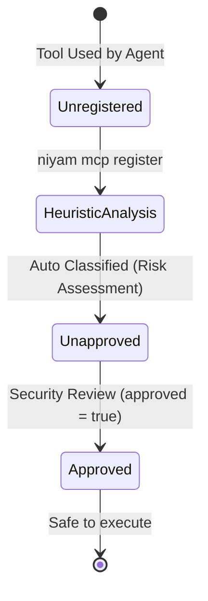

# Security & Access Governance Specification: Niyam Guard

## 1. Access Control & Tool Approvals
To maintain safe environments during AI agent runs, Niyam enforces strict access control policies on registered tools.

### Approved Status Flow

* **Tool Whitelisting:** By default, all registered tools are stored under `.niyam/mcp-registry.json`.
* **Execution Block Policy:** If an agent attempts to execute an unapproved tool with a risk level of `high` or `critical`, Niyam alerts the developer and records a high-risk policy infraction in `evidence.md`.

---

## 2. Redaction Pipeline Engine
Niyam integrates an inline redaction filter that streams output logs and command arguments, scrubbing sensitive credentials before they persist in local logs or evidence reports.

### Redaction Regex Specifications
The redaction engine evaluates text lines against the following standard regular expression patterns:

| Target Credential | Regex Pattern | Replacement |
| --- | --- | --- |
| **AWS Access Key ID** | `(A3T[A-Z0-9]|AKIA|AGPA|AIDA|AROA|ASCA|ASIA)[A-Z0-9]{16}` | `[REDACTED_AWS_KEY]` |
| **AWS Secret Access Key** | `(?i)aws(.{0,20})?['\"][0-9a-zA-Z\/+]{40}['\"]` | `[REDACTED_AWS_SECRET]` |
| **Generic API Tokens** | `(?i)(token|api_key|apikey|bearer|passwd|secret)\s*[:=]\s*['\"][^'\"]+['\"]` | `\1: [REDACTED_SECRET]` |
| **Private Keys (PEM/RSA)** | `-----BEGIN\s+([A-Z\s]+)\s+PRIVATE\s+KEY-----[\s\S]+?-----END\s+\1\s+PRIVATE\s+KEY-----` | `[REDACTED_PRIVATE_KEY]` |

### Stream Interception Architecture
When running commands under `niyam guard run`:
1. Stdout and stderr bytes are read from the subprocess stream line-by-line.
2. The byte strings are decoded to UTF-8 (falling back to surrogate-escapes for binary content).
3. The redaction regexes run sequentially, replacing matches with redacted labels.
4. Redacted lines are written to the `.niyam/logs/guard-actions.jsonl` database (if `--capture-output` is enabled).

---

## 3. Sandboxing & Path Freeze Mechanics
Niyam prevents rogue agents from modifying critical project assets by enforcing **path freezes**.

### Path Write Restrictions
* The folder path list is defined under `guard.frozen_paths` in `.niyam/niyam.yaml`.
* **Pre-Execution Check:** Before starting any command in a subprocess, Niyam scans the command string. If the command references, writes, or modifies frozen files (e.g. `rm -rf tests/`), the command execution is halted with an exit code of $127$ (Access Denied).
* **Git Hook Enforcement:** Niyam installs standard git pre-commit hooks that cross-reference modified files against frozen paths. If any changes are detected inside frozen directories during an active agent session, the commit is rejected.

### Shell Privilege Escalation Blocks
To prevent agents from executing commands that alter host environments, Niyam blocks the following command patterns:
* Prefixing command inputs with `sudo` or `su`.
* Writing file targets outside the project root path (preventing host path traversal attacks like writing to `/etc/passwd` or `/usr/bin/`).

---

## 4. Threat Modeling: MCP & Tool Registries
Evaluating risks associated with Model Context Protocol (MCP) servers and external web APIs.

| Threat | Likelihood | Impact | Mitigation Strategy |
| --- | --- | --- | --- |
| **MCP Server Directory Escape** | Medium | High | Restrict filesystem MCP server arguments to the project root absolute path. Validate arguments before spawning. |
| **Credential Exposure in CLI Arguments** | High | Medium | Run arguments through the Redaction Pipeline before writing command histories to `guard-actions.jsonl`. |
| **Unauthorized SaaS API Write** | Low | High | Enforce heuristic reviews during `niyam mcp register`. Warn on SaaS endpoints with unapproved write capabilities. |
| **Agent Executing Host Terminal Scripts** | Medium | Critical | Prohibit raw bash/zsh tools from running without developer approval prompts (`niyam guard careful`). |
