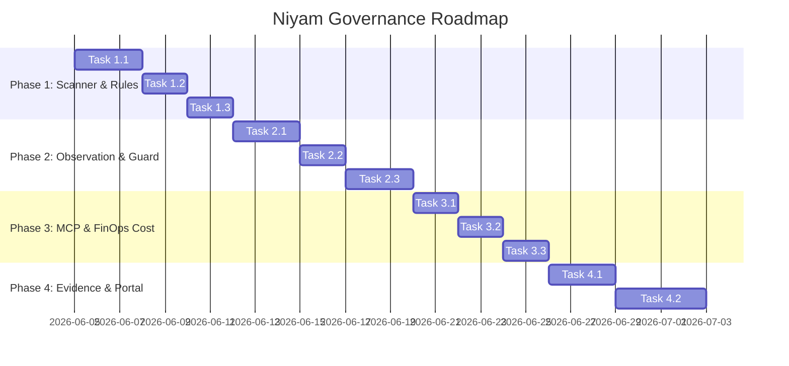

# Feature Implementation Ticket List

This document lists the implementation tickets, prioritized and split into logical development phases. Each ticket contains clear descriptions, acceptance criteria, dependencies, and estimation metrics.

---

## Phased Roadmap Overview

---

## Phase 1: Scanner Core & YAML Rules (EPIC-001)

### Ticket 1.1: Core Match Types Engine
* **Type:** Feature (Core)
* **Title:** Implement 7 Core Match Types for Scanner Engine
* **Description:** Add full evaluation logic in `niyam/core/scan.py` for matching methods: `file_exists`, `file_missing`, `filename_pattern`, `content_contains`, `content_regex`, `directory_exists`, and `directory_missing`.
* **Acceptance Criteria:**
  1. `filename_pattern` matches files using standard Unix glob rules.
  2. `content_regex` runs case-insensitive searches inside allowed text extension files.
  3. Binary files must be automatically skipped during full content inspections.
* **Dependencies:** None
* **Estimated Effort:** 3 Story Points

### Ticket 1.2: Profile Configs & Deduction Scoring
* **Type:** Feature (Core)
* **Title:** Implement Scan Profiles and Severity Deduction Logic
* **Description:** Parse YAML profile rules files (`startup.yaml`, `team.yaml`, `enterprise.yaml`). Implement the scoring algorithm subtracting weights from $100$ and returning launch status labels.
* **Acceptance Criteria:**
  1. Deductions compute correctly (Critical = 25, High = 15, Medium = 8, Low = 3).
  2. Returns the correct decision code: `GO` (>=90), `CONDITIONAL_GO` (75-89), `HIGH_RISK` (50-74), and `NO_GO` (<50).
* **Dependencies:** Ticket 1.1
* **Estimated Effort:** 2 Story Points

### Ticket 1.3: CLI `niyam scan` Command Updates
* **Type:** Feature (CLI)
* **Title:** Enhance `niyam scan` Command Options and Text/Markdown/JSON Exporters
* **Description:** Implement Typer options (`--profile`, `--output`, `--rules`, `--report-file`) in `niyam/cli/scan.py` and print tabular outcomes using the `rich` console.
* **Acceptance Criteria:**
  1. `niyam scan . --output json` dumps parseable findings schema.
  2. `--report-file` writes formatted markdown reports to target destinations.
* **Dependencies:** Ticket 1.2
* **Estimated Effort:** 2 Story Points

---

## Phase 2: Action Governance & Subprocess Hook (EPIC-002)

### Ticket 2.1: Subprocess Wrapper execution (`niyam guard run`)
* **Type:** Feature (Core)
* **Title:** Implement Command Observation Subprocess execution Wrapper
* **Description:** Write wrapper engine in `niyam/core/security.py` that spawns commands inside a subprocess, records duration/exit codes, and appends records to `.niyam/logs/guard-actions.jsonl`.
* **Acceptance Criteria:**
  1. Wraps commands containing piping and flags (e.g. `niyam guard run -- npm test`).
  2. Records execution durations to millisecond accuracy.
* **Dependencies:** None
* **Estimated Effort:** 3 Story Points

### Ticket 2.2: Stream Redaction Pipeline
* **Type:** Feature (Core)
* **Title:** Implement Regex Secret Redaction Pipeline
* **Description:** Run captured stdout/stderr streams and arguments through regex patterns to filter keys, tokens, and authorization parameters.
* **Acceptance Criteria:**
  1. AWS keys are replaced with `[REDACTED_AWS_KEY]`.
  2. Raw stdout capture is disabled by default unless `--capture-output` is toggled.
* **Dependencies:** Ticket 2.1
* **Estimated Effort:** 2 Story Points

### Ticket 2.3: Active Path Freeze Engine
* **Type:** Feature (Core)
* **Title:** Implement Path Freeze Checks and Git Commit Block Hooks
* **Description:** Build validation interceptors that block subprocess commands or git commits from modifying files defined under `guard.frozen_paths`.
* **Acceptance Criteria:**
  1. Pre-execution checks raise hard failures if edit commands target frozen paths.
  2. Git pre-commit script halts runs if staged files contain edits inside frozen folders.
* **Dependencies:** Ticket 2.1
* **Estimated Effort:** 3 Story Points

---

## Phase 3: MCP & FinOps Cost Engine (EPIC-003)

### Ticket 3.1: Tool Registry Risk Classifier
* **Type:** Feature (Core)
* **Title:** Implement MCP Tool Registry JSON store and Risk Classifier Heuristics
* **Description:** Develop file operations for `.niyam/mcp-registry.json`. Write classifier rules assigning risks (`low` to `critical`) depending on capabilities and types.
* **Acceptance Criteria:**
  1. `niyam mcp register` adds tools and saves configurations safely.
  2. Tools requesting command executions default to `critical` risk rating.
* **Dependencies:** None
* **Estimated Effort:** 2 Story Points

### Ticket 3.2: Cost Logging & Pricing Config
* **Type:** Feature (Core)
* **Title:** Build Token Cost Logger and pricing JSON Setup
* **Description:** Log usage parameters to `.niyam/logs/cost-events.jsonl` and calculate USD costs against lookup rate entries inside `.niyam/pricing.json`.
* **Acceptance Criteria:**
  1. Automatically creates default pricing structures if `.niyam/pricing.json` is missing.
  2. Correctly logs estimated costs using prompt/completion token weights.
* **Dependencies:** None
* **Estimated Effort:** 2 Story Points

### Ticket 3.3: FinOps Summary Report Command
* **Type:** Feature (CLI)
* **Title:** Implement CLI Commands for Cost Summaries and Spend Reports
* **Description:** Write calculations grouping spending metrics by day, repository, and task. Highlight budget wastage.
* **Acceptance Criteria:**
  1. `niyam cost summary` prints total token counts and USD expenses.
  2. `niyam cost report` outputs detailed tables showing wasted spends.
* **Dependencies:** Ticket 3.2
* **Estimated Effort:** 2 Story Points

---

## Phase 4: Joint Evidence Compiler & Dashboard API (EPIC-004)

### Ticket 4.1: Evidence compiler Engine
* **Type:** Feature (Core)
* **Title:** Implement Unified Evidence Report Compiler
* **Description:** Develop compiler logic assembling scanner scores, audit trails, and registered tool risks into Markdown or HTML templates via Jinja2.
* **Acceptance Criteria:**
  1. Missing sections (e.g. no guard actions) must be skipped gracefully without errors.
  2. Outputs contain no unmasked credentials or passwords.
* **Dependencies:** Ticket 1.3, Ticket 2.2, Ticket 3.1, Ticket 3.3
* **Estimated Effort:** 3 Story Points

### Ticket 4.2: Local API Dashboard Server
* **Type:** Feature (Portal)
* **Title:** Implement Dashboard Portal CLI and Local JSON API Server
* **Description:** Build `niyam dashboard` command launching a local Node.js or FastAPI server serving static frontend files and exposing APIs to query Niyam logs.
* **Acceptance Criteria:**
  1. Command runs a background process opening `http://localhost:8080` in browsers.
  2. API endpoints correctly fetch and serialize local YAML/JSON/JSONL database files.
* **Dependencies:** Ticket 4.1
* **Estimated Effort:** 4 Story Points
