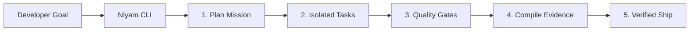

# Niyam

**Governed autonomous development for AI coding agents.**

> One `.niyam/` source of truth. Many AI runtimes. Policy-driven autonomy. Evidence-backed delivery.

[](https://badge.fury.io/py/niyam)
[](https://opensource.org/licenses/MIT)

---

## 🚀 What is Niyam?

Niyam bridges the gap between fast "vibe coding" and production-grade safety. It turns any repository into a governed AI-development workspace where you define the rules, and AI agents (Claude Code, Codex, Gemini) follow them.

### Key Capabilities:
*   **🛡️ Active Guardrails:** Intercept dangerous shell commands and redact secrets in real-time.
*   **🤖 Multi-Agent Orchestration:** Define specialized roles (Backend, QA, Security) with custom prompts.
*   **Isolated Missions:** Run complex, multi-step tasks in isolated Git worktrees with strict contracts.
*   **🔍 Readiness Scanning:** Audit your repo against `startup`, `enterprise`, or `regulated` profiles.
*   **📑 Evidence Hub:** Automatically compile audit trails, scan results, and cost reports for every session.

---

## 🎬 How it Works



### 1. Interactive Development (Day-to-Day)
Use Niyam-defined slash commands directly inside your AI agent:
```bash
/implement "add JWT authentication"
```
*Niyam ensures the agent writes tests first and follows your team's architecture.*

### 2. Autonomous Missions (Batch Tasks)
Let Niyam orchestrate multiple sub-agents for you:
```bash
niyam run "migrate all API endpoints to v2"
```
*Tasks run in parallel, isolated in branches, and merged only after passing validation.*

---

## 📸 Guided Tour

> **Note to maintainers:** Capture and add these screenshots to `docs/images/` to make the README pop!

### 🟢 Readiness Scan

*Detailed audit report with scoring and compliance checks.*

### 🔴 Active Guardrails

*Niyam blocking a destructive command and redacting a leaked API key.*

---

## 🛠️ Installation

**Global Install (Recommended)**
```bash
pipx install niyam
```

**Run on the fly (No install)**
```bash
uvx --from niyam niyam --help
```

---

## ⏱️ Quick Start (in 60 seconds)

1. **Initialize your workspace:**
   ```bash
   niyam init --profile fullstack --runtime claude
   ```
2. **Refresh project context:**
   ```bash
   niyam context refresh
   ```
3. **Synchronize with AI agent:**
   ```bash
   niyam sync
   ```
4. **Start building:**
   Open your agent (e.g. `claude`) and use `/implement`, `/review`, or `/ship`.

---

## 📚 Documentation & Architecture

Niyam is designed to be the "AI Orchestrator" sitting above your coding tools.

*   [**CLI Reference Guide**](docs/cli-reference.md)
*   [**Governance Specification**](docs/governance.md)
*   [**Migration from Sutra**](docs/migration-from-sutra.md)

### Target Architecture
```
.niyam/              ← Source of truth (Versioned in Git)
├── niyam.yaml       ← Workspace configuration
├── agents/          ← Agent role definitions (Backend, Frontend, etc.)
├── skills/          ← Composable methodology packs (TDD, Plan, Review)
├── commands/        ← Custom slash-command workflows
└── policies/        ← Active guardrails and path freezes
```

---

## 🗺️ Roadmap

See [ROADMAP.md](ROADMAP.md) for our vision on parallel execution, web dashboards, and enterprise CI/CD integration.

## 🤝 Contributing

We welcome contributions! See our [Contribution Guide](CONTRIBUTING.md) to get started.

## 📄 License

Distributed under the MIT License. See `LICENSE` for more information.
