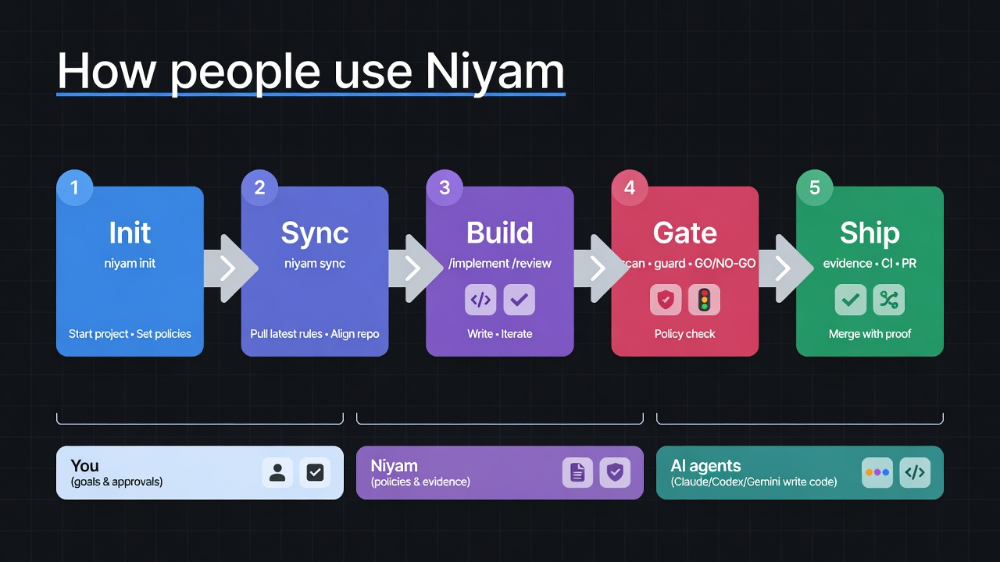
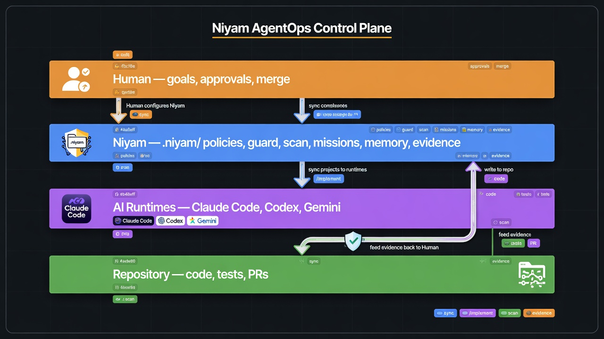

# Niyam

**Niyam is an open-source AgentOps control plane for governed autonomous AI development.** It provides safety guardrails, portable memory ledgers, and human-in-the-loop approval gates to run AI coding agents (such as Claude Code, Cursor, and Gemini) with production-grade safety and reliability.

> One `.niyam/` source of truth. Many AI runtimes. Policy-driven autonomy. Portable memory. Evidence-backed delivery.

[](https://badge.fury.io/py/niyam)
[](https://opensource.org/licenses/MIT)

---

## What is Niyam? AgentOps and AI Governance

Niyam bridges the gap between fast "vibe coding" and production-grade safety. It turns any repository into a governed AI-development workspace where you define the rules, and AI agents follow them.

Niyam acts as an **AgentOps control plane** for teams that need to govern what AI agents do, what tools they use, what memory they rely on, and what evidence they produce. It is built for:
*   **AI Agent Governance & Safety:** Prevent runaway agents and enforce workspace boundaries.
*   **Active Command Guardrails:** Block or intercept dangerous shell commands (e.g. `rm -rf`, database drops).
*   **Model Context Protocol (MCP) Memory Server:** Provide structured, inspectable, and portable memory ledgers for AI agents.
*   **Credential & Secret Redaction:** Real-time scanning and redaction of PII and API keys from agent execution logs.
*   **Browser Agent Supervision:** Control and record browser actions executed by autonomous agents.
*   **FinOps & Token Cost Tracking:** Track actual agent spend and token consumption locally.
*   **Audit-Ready Evidence Reports:** Synthesize scan results, command histories, and approval logs into compliance documents.

---

## Installation & Setup

**Global Install (Recommended)**
```bash
pipx install niyam
```

**Upgrade to the latest version:**
```bash
pipx upgrade niyam
```

**Run on the fly (No install)**
```bash
uvx --from niyam niyam --help
```

**Enable Smart Autocomplete (Bash/Zsh/Fish/PowerShell)**
```bash
niyam completion install
```

---

## How Niyam Works (Visual)





Interactive diagrams: **[docs/user-flows.html](docs/user-flows.html)** · Written guide: **[docs/user-guide.md](docs/user-guide.md)**

---

## Niyam in Action

### 1. Interactive Development (Day-to-Day)
Niyam acts as a governance layer inside your AI agent. Use team-standard slash commands:
```bash
/implement "add password complexity rules to auth service"
```
*Niyam ensures the agent writes tests first, respects file freezes, and follows the approved TDD workflow.*

### 2. Autonomous Missions (Batch Tasks)
Orchestrate complex migrations or large-scale refactors with ease:
```bash
niyam run "migrate all API endpoints to v2"
```
*Niyam plans the mission, executes dependency-aware task layers, can isolate write tasks in **Git worktrees**, and records validation evidence.*

### 3. Governed LoopOps (Agentic Loops)
Define strict execution budgets and let agents iterate autonomously until success or intervention:
```bash
niyam loop run loops/security-audit.yaml --require-approval-on high-risk
```
*Niyam orchestrates the planner, implementer, and evaluator agents, tracking cost and risk at every iteration.*

---

## Key Features

### Active Action Governance & Approvals
*   **Command Guardrails:** Intercept and block dangerous shell commands (e.g., destructive database drops or global file deletions) before execution.
*   **Path Freezing:** Restrict agents to specific scopes. Protect core files like `LICENSE` or sensitive `infra/` folders from unauthorized AI writes.
*   **Credential Redaction:** A built-in engine that identifies and redacts secrets, API keys, and PII from agent logs and CLI outputs in real-time.
*   **Enterprise Approval Gates:** Role-based (e.g., Product, QA, Security) manual approval gates for critical tasks and mission plans directly from the CLI or Portal UI.


### Multi-Agent Orchestration & Resilience
*   **Agent Roles:** Define specialized AI personas (e.g., `security-reviewer`, `qa-engineer`) with tailored system prompts and dedicated toolsets.
*   **Isolated Multi-Worktree Parallelism:** Run tasks in parallel using isolated **Git Worktrees**, preventing agent cross-talk and ensuring clean, atomic PRs.
*   **Swarm Coordination:** Track active agents, heartbeats, file locks, and negotiation requests through local swarm state.
*   **Autonomous Environment Healing:** Experimental auto-heal retries feed validation failures back into task prompts and can trigger AI re-planning.

### Compliance & Readiness Checking
*   **Repo Audits:** Scan your repository against strict profiles (`startup`, `team`, `enterprise`, `regulated`) to detect missing documentation, unpinned dependencies, or secret exposures.
*   **Readiness Scoring:** Get a numerical **Readiness Score (0-100)** and a clear **GO / NO-GO** decision for every branch or mission.
*   **CI/CD Pipeline Scaffolding:** Generate ready-to-use CI/CD workflows (`niyam ci generate [github/gitlab/azure]`) that run strict policy validations (`niyam ci verify`) directly in your pull requests.

### Evidence, Memory, Control Room, and FinOps
*   **Joint Evidence Reports:** Automatically synthesize scan findings, observed command logs, Model Context Protocol (MCP) registry posture, Memory Ledger posture, Control Room activity, browser actions, approvals, and cost data into standardized, audit-ready compliance documents.
*   **Memory Ledger:** Portable, inspectable, policy-governed agent memory with structured records, import/export, diffing, redaction, recall lineage, policy checks, and a Model Context Protocol (MCP) compatible memory server.
*   **Control Room:** Local-first supervised human-agent task rooms with workspace sessions, append-only timelines, approval gates, browser-action recording, takeover state, and task evidence exports.
*   **FinOps Cost Tracking:** A local ledger that logs every token consumed and estimates USD spend against customizable pricing tables.

### LoopOps & Fleet Execution
*   **Governed AI Feedback Loops:** Use `niyam loop run` to execute multi-step AI tasks with deterministic budgets, automated evaluation, and explicit human-in-the-loop approval gates.
*   **Fleet-Wide Missions:** Run loops concurrently across an entire portfolio of repositories via `niyam loop run --fleet`, automatically resolving dependency DAGs between repos.
*   **Audit-Ready Loop Reports:** Generate evidence and visual HTML reports for every loop execution.

### Enhanced CLI UX
*   **Smart Autosuggestion:** Integrated suggestion engine offering typo correction ("Did you mean?"), context-aware flags, and alias resolution.
*   **Shell Autocompletion:** Native `<TAB>` completion support for Bash, Zsh, Fish, and PowerShell (`niyam completion install`).

---

## Live Mission Dashboard & Web Portal

Niyam provides both terminal-based and browser-based interfaces to monitor your autonomous agents and manage approvals:

### 1. Terminal Dashboard
```bash
niyam dashboard --watch
```
*   **Live Task Progress:** Visual status of all mission tasks (Planned, Running, Completed, Failed).
*   **Real-time Logs:** View active output from implementation agents as they work in isolated worktrees.
*   **Validation Monitor & Resource Efficiency:** Watch unit tests and lint checks run and report results live, alongside actual token spend.

### 2. Browser-Based Portal UI
```bash
niyam portal
```
*   **Policy Analytics:** Visual cards detailing Active Guardrails, Command Filters, Security Isolation, and active Path Freezing.
*   **Interactive Approval Center:** Review pending tasks/missions and authorize execution by role directly from the Web UI.
*   **FinOps & Agent Metrics:** Monitor token consumption, cost breakdowns, and agent success rates.

---

## Quick Start

1. **Initialize your workspace:**
   ```bash
   niyam init --profile fullstack --runtime claude
   ```
2. **Synchronize with AI agent:**
   ```bash
   niyam sync
   ```
3. **Start building:**
   Open your agent (e.g. `claude`) and use `/implement`, `/review`, or `/ship`.

For full user journeys (missions, scan/guard, evidence, Control Room, CI), see the **[User Guide](docs/user-guide.md)**.

**Visual flows (open in a browser):** [docs/user-flows.html](docs/user-flows.html)

## AgentOps Workflows

**Govern portable agent memory:**
```bash
niyam memory init
niyam memory validate
niyam memory recall "deployment preference"
niyam memory policy-check
niyam memory serve-mcp
```

**Register the Memory Ledger MCP server:**
```bash
niyam mcp register-memory-server
```

**Run a supervised Control Room task:**
```bash
niyam workspace create "Research competitor pricing" --session-id TASK-001
niyam workspace browser-start TASK-001 --url https://example.com
niyam workspace browser-action TASK-001 --type submit --target "#publish"
niyam workspace evidence TASK-001 --format markdown
```

**Generate audit-ready evidence with AgentOps sections:**
```bash
niyam evidence --include scan,guard,mcp,cost,memory,workspace
```

## Maturity Guide

| Capability | Status |
| --- | --- |
| Workspace init, runtime sync, context refresh | Stable |
| Scan, guard, evidence, cost tracking | Experimental but covered by tests |
| Memory Ledger, MCP memory server, Control Room workspace, browser recorder | Preview |
| Mission planning/execution, worktree isolation | Experimental |
| Swarm coordination, RAG indexing, auto-heal | Preview |

Preview features are local-first and test-covered, but their command shape and defaults may evolve before GA.

---

## Documentation & Architecture

*   [**User Guide**](docs/user-guide.md) — How Niyam is expected to work: setup, day-to-day flows, missions, governance, and command map.
*   [**Visual User Flows**](docs/user-flows.html) — Interactive diagrams for setup, daily work, missions, governance, and ship.
*   [**CLI Reference Guide**](docs/cli-reference.md) — Comprehensive command line interface (CLI) usage and commands.
*   [**AgentOps Control Plane Architecture**](docs/agentops-platform.md) — Under the hood of Niyam's platform design.
*   [**Memory Ledger & Context Portability**](docs/memory-ledger.md) — Governed agent memory management.
*   [**Model Context Protocol (MCP) Memory Server**](docs/mcp-memory-server.md) — Integrating Niyam memory with MCP-compatible agents.
*   [**Control Room Operations Guide**](docs/control-room.md) — Supervised task rooms and human-in-the-loop approval workflows.
*   [**Browser Sandbox & Safety Guide**](docs/browser-sandbox.md) — Governing autonomous web browser actions.
*   [**Governance Specification & Policy Engine**](docs/governance.md) — Rules, exception lifecycles, and blocker logic.
*   [**MCP Tool Governance Registry**](docs/mcp.md) — Gating and auditing agent tool usage.
*   [**Migration Guide from Sutra to Niyam**](docs/migration-from-sutra.md) — Upgrade instructions and compatibility.

---

## Roadmap

See [ROADMAP.md](ROADMAP.md) for the AgentOps roadmap, including Memory Ledger, Control Room, web dashboards, and enterprise CI/CD integration.

## Frequently Asked Questions (FAQ)

### What is an AgentOps Control Plane?
An AgentOps control plane is the infrastructure layer that monitors, manages, and governs autonomous AI agents within a development environment. It enforces policy execution, limits budgets (token cost), logs agent behaviors, and registers available tools (via Model Context Protocol) to ensure safe development.

### How does Niyam enforce AI agent guardrails?
Niyam sits as a wrapper around command execution and workspace operations. Using the `niyam guard` module, it intercepts terminal commands before they run, blocks denied commands (e.g., destructive database operations), redacts credentials, and enforces path locks so agents cannot write to frozen directories.

### Can Niyam be integrated with Model Context Protocol (MCP)?
Yes. Niyam includes a built-in MCP-compatible memory server. By running `niyam mcp register-memory-server`, you can expose the Niyam Memory Ledger to any MCP-supporting AI agent (such as Claude Code or Cursor) to retrieve and update task state, workspace rules, and developer context dynamically.

### What is a Memory Ledger in AI development?
A Memory Ledger is a structured, append-only ledger of agent context and decisions. Unlike plain text scratchpads, Niyam's Memory Ledger preserves a verifiable lineage of why decisions were made, filters out PII/secrets before saving, and makes context portable so different agents can share the same state.

### How do human-in-the-loop approval gates work?
When an agent plans a complex mission (like migrating database tables or refactoring APIs), Niyam generates a mission plan. Critical actions or high-risk tasks require approval from designated roles (Product, QA, Security). The developer or team leads can approve or reject these tasks directly via the CLI or Niyam Portal UI.

---

## License

Distributed under the MIT License. See `LICENSE` for more information.
