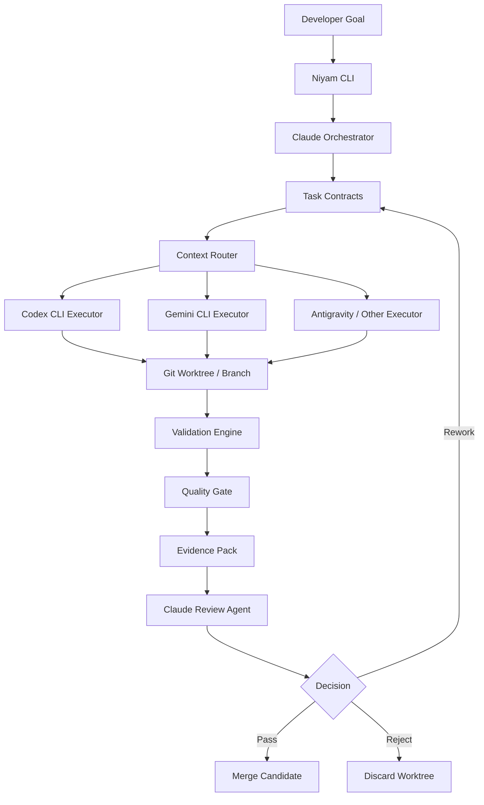

# Niyam Roadmap & Target Architecture

## Current status as of 2026-06-09

Niyam has moved past the original governance MVP plan and is now tracking toward
the `1.0.0-rc1` release line.

Validated on 2026-06-09:

```text
144 passed, 1 warning in 75.95s
```

Validation command:

```bash
pytest tests/test_rules.py tests/test_readiness_scoring.py tests/e2e/test_scan_e2e.py tests/test_guard_observe.py tests/test_redaction.py tests/test_path_freeze.py tests/e2e/test_mcp_e2e.py tests/test_cost.py tests/e2e/test_evidence_e2e.py tests/test_scan_ci_gates.py tests/test_mission.py tests/test_parallelism.py tests/test_swarm.py tests/test_fleet_cli.py tests/test_pr.py
```

### Completed capabilities

| Capability | Status | Validation |
| --- | --- | --- |
| Scanner core, built-in profiles, custom rules, readiness scoring | Complete | `tests/test_rules.py`, `tests/test_readiness_scoring.py`, `tests/e2e/test_scan_e2e.py` |
| `niyam scan` CLI output, reports, and CI gate behavior | Complete | `tests/test_scan_ci_gates.py`, `tests/e2e/test_scan_e2e.py` |
| Guard observe/warn/block/approval modes and subprocess audit logs | Complete | `tests/test_guard_observe.py` |
| Redaction pipeline for logs, reports, dictionaries, and review text | Complete | `tests/test_redaction.py` |
| Path freeze apply/restore safety behavior | Complete | `tests/test_path_freeze.py` |
| MCP/tool registry workflow and risk reporting | Complete | `tests/e2e/test_mcp_e2e.py` |
| Token cost logging, summaries, and repository reports | Complete | `tests/test_cost.py` |
| Evidence report compiler with redaction | Complete | `tests/e2e/test_evidence_e2e.py` |
| Mission planning, execution lifecycle, budgets, approvals, metrics, audit | Complete | `tests/test_mission.py` |
| Parallel discovery/implementation serialization and DAG ordering | Complete | `tests/test_parallelism.py` |
| Swarm locking, heartbeat, stale recovery, ledger, and CLI integration | Complete | `tests/test_swarm.py` |
| Fleet discovery/status/policy sync | Complete | `tests/test_fleet_cli.py` |
| PR creation/review evidence flows | Complete | `tests/test_pr.py` |

### Research inputs for next phase

The updated pending roadmap is informed by the local validation run above and
current governance/security guidance:

- NIST AI RMF: govern, map, measure, and manage AI risk with evidence and
  repeatable controls.
- NIST AI RMF Generative AI Profile: account for generative-AI-specific risks in
  operational workflows.
- OWASP Agentic Skills Top 10: agent skills and tool-use layers need inventory,
  approval, least privilege, isolation, monitoring, and incident response.
- OpenSSF SLSA: release artifacts need stronger provenance and supply-chain
  integrity.
- OpenSSF Scorecard: repository security posture should be measured through
  automated checks.

References:

- https://www.nist.gov/itl/ai-risk-management-framework
- https://owasp.org/www-project-agentic-skills-top-10/
- https://slsa.dev/
- https://openssf.org/projects/scorecard/

### Pending roadmap

| Priority | Item | Why it matters | Deliverables | Validation |
| --- | --- | --- | --- | --- |
| P0 | `1.0.0-rc1` release readiness | Core capability is implemented; the next risk is shipping stale docs or unverified packages. | Full-suite validation, release notes, refreshed CLI reference, package/install smoke tests, known-warning log, examples refresh. | `pytest`, package build/install smoke, CLI help smoke, example commands. |
| P1 | Dashboard and operator evidence UX | Governance data exists but needs one coherent operator surface for review and audit. | Local dashboard/API views for scan, guard, MCP, cost, evidence, mission, swarm, fleet, and PR evidence. | API tests, dashboard smoke tests, generated evidence fixture review. |
| P1 | CI/CD and supply-chain hardening | Complete | `tests/test_ci_generators.py` |
| P1 | Task-contract canonical model | Complete | `tests/test_contract_schema.py` |
| P2 | Agent skill/tool governance | Complete | `tests/test_skills_governance.py` |
| P2 | Enterprise policy workflows | Complete | `tests/test_policy_workflows.py` |
| P3 | Fleet-level mission dispatch | Complete | `tests/test_fleet_dispatch.py` |
| P3 | Agent performance analytics | Complete | `tests/test_performance_analytics.py` |

### AgentOps strategic roadmap aligned to current structure

Strategic direction:

> Niyam is the AgentOps control plane for governed AI agent execution, memory,
> tools, approvals, and evidence.

This direction adds two modules to the existing platform rather than creating a
new product line:

1. **Niyam Memory Ledger:** portable, inspectable, policy-governed memory for
   MCP-era agents.
2. **Niyam Control Room:** supervised human-agent execution through the existing
   mission, portal, guard, swarm, MCP, and evidence foundation.

Current repo alignment:

| Strategic concept | Current structure to build on | Roadmap stance |
| --- | --- | --- |
| Memory Ledger | `niyam/cli/memory.py`, `niyam/core/memory.py`, `.niyam/memory/index.jsonl` seed records | Extend in place; preserve `show`, `add`, and `clear`. |
| Tool governance | `niyam/cli/mcp.py`, `niyam/core/mcp.py`, `.niyam/mcp-registry.json` | Reuse for MCP memory server registration and skill/tool risk. |
| Execution governance | `niyam guard`, `niyam mission`, `niyam swarm`, portal API | Build Control Room on top of these, not beside them. |
| Evidence | `niyam evidence`, `niyam/governance/evidence`, templates | Add `memory` and `control-room` sections without changing existing includes. |
| Portal | `niyam/api/server.py`, `niyam/templates/portal/index.html` | Extend current mission portal into operator evidence UX. |
| Fleet | `niyam fleet` | Later dispatch and fleet evidence rollups. |

Open naming decision:

- The proposed `niyam workspace` command is useful for the Control Room concept,
  but it is not part of the current CLI. The roadmap should treat it as a
  candidate command group for a later phase. Until then, Control Room work should
  extend `mission`, `portal`, `guard`, `swarm`, and `evidence` without breaking
  current commands.

### Phased development plan

#### Phase A: Documentation and Release Alignment

Status: complete as of 2026-06-09.

Goal: align positioning and roadmap without runtime behavior changes.

Deliverables:

- Update README positioning to include AgentOps control plane language.
- Add docs for AgentOps platform, Memory Ledger, and Control Room concepts.
- Update CLI reference with a clearly marked "planned commands" section.
- Refresh examples and release notes for `1.0.0-rc1`.
- Keep all current commands and storage behavior unchanged.

Acceptance:

- Documentation explains how Memory Ledger and Control Room fit the current
  `memory`, `mcp`, `guard`, `mission`, `swarm`, `portal`, `fleet`, and
  `evidence` modules.
- No code behavior changes.
- `git diff --check` passes.

#### Phase B: Memory Ledger Core

Status: complete as of 2026-06-09.

Goal: upgrade existing project memory into a structured local ledger while
preserving current markdown memory behavior.

Build on:

- `niyam/cli/memory.py`
- `niyam/core/memory.py`
- `.niyam/memory/index.jsonl`

Proposed additions:

```text
niyam/core/memory_ledger/
├── __init__.py
├── models.py
├── local_store.py
├── manifest.py
├── diff.py
└── schemas.py
```

CLI additions:

```bash
niyam memory init
niyam memory list
niyam memory validate
niyam memory export
niyam memory import
niyam memory diff
```

Compatibility requirements:

- `niyam memory show` remains unchanged.
- `niyam memory add` still appends to markdown memory files and also writes a
  structured index record.
- `niyam memory clear` still clears markdown memory files only.
- Existing `.niyam/memory/*.md` files remain valid.

Acceptance:

- Pydantic memory record validation.
- Local JSONL store under `.niyam/memory/index.jsonl`.
- JSON/YAML import-export round trip.
- Memory diff detects added, removed, and changed records.
- Existing memory tests still pass.

Validation:

```bash
pytest tests/test_memory_ledger.py tests/test_memory.py tests/test_cli.py tests/regression/test_existing_cli_compatibility.py
pytest tests/test_redaction.py tests/test_evidence_extended.py tests/test_governance_integration.py
```

#### Phase C: Memory Policy, Redaction, and Lineage

Status: complete as of 2026-06-09.

Goal: make memory governable and auditable.

Deliverables:

- Memory scopes: `user`, `project`, `workspace`, `organization`.
- Ownership fields and source attribution.
- Retention and expiry checks.
- Redaction checks using the existing redaction foundation.
- Recall trace events under `.niyam/memory/lineage/`.
- Memory policy findings that can be consumed by evidence reports.

CLI additions:

```bash
niyam memory redact
niyam memory policy-check
niyam memory trace
niyam memory recall
```

Acceptance:

- Sensitive memory detection and redaction tests.
- Scope and retention policy tests.
- Recall trace tests.
- Evidence fixture includes memory findings.

Validation:

```bash
pytest tests/test_memory_ledger.py tests/test_memory.py tests/test_cli.py tests/regression/test_existing_cli_compatibility.py tests/test_memory_policy.py tests/test_memory_redaction.py tests/test_memory_lineage.py tests/test_memory_recall.py tests/test_memory_evidence.py
pytest tests/test_redaction.py tests/test_evidence_extended.py tests/test_governance_integration.py
```

#### Phase D: MCP-Compatible Memory Server

Status: complete as of 2026-06-09.

Goal: expose governed memory to MCP-compatible clients without introducing a
new storage backend requirement.

Build on:

- `niyam mcp` registry
- Memory Ledger local store
- Existing policy and redaction engines

Proposed additions:

```text
niyam/mcp/
└── memory_server.py
```

MCP operations:

```text
memory.create
memory.search
memory.recall
memory.update
memory.delete
memory.export
memory.trace
memory.policy_check
```

Acceptance:

- MCP server uses the same local Memory Ledger store.
- MCP server can be registered through `niyam mcp register`.
- Operations are covered by unit tests.
- No external service dependency is required for the default path.

Validation:

```bash
pytest tests/test_mcp_memory_server.py tests/test_memory_ledger.py tests/test_memory_policy.py tests/test_memory_recall.py tests/test_mcp.py
python3 -m compileall niyam/mcp niyam/cli/memory.py niyam/cli/mcp.py
```

#### Phase E: Control Room MVP

Status: Complete.

Goal: add supervised execution-room primitives on top of existing mission,
guard, swarm, and portal capabilities.

Command naming:

- Preferred implementation path: extend current `mission` and `portal` surfaces
  first.
- Candidate later command group: `niyam workspace`.
- Do not add a new command group until the CLI shape is validated by docs and
  tests.

Deliverables:

- Workspace/session model for a supervised task room.
- Action timeline JSONL for prompts, tool calls, browser/code actions,
  approvals, memory recalls, memory writes, outputs, and errors.
- Approval events as first-class timeline entries.
- Session evidence adapter.
- Memory references linked to session evidence.

Proposed additions after naming is confirmed:

```text
niyam/core/workspace/
├── __init__.py
├── models.py
├── timeline.py
├── approvals.py
└── evidence.py
```

Acceptance:

- Sessions are stored under `.niyam/workspace/`.
- Timeline records are append-only JSONL.
- Approval required/approved/rejected events are test-covered.
- Session evidence can be generated without changing existing evidence output.

#### Phase F: Browser Sandbox and Human Takeover

Status: Complete.

Goal: make Control Room demonstrable through a narrow browser-agent workflow.

Deliverables:

- Browser sandbox abstraction, likely Playwright-based.
- Domain/action policy checks through existing guard/policy primitives.
- Pause, resume, approval, reject, and takeover state transitions.
- Screenshot/artifact capture under `.niyam/workspace/artifacts/`.
- Evidence export with action timeline and artifacts.

Acceptance:

- Browser workflow fixture runs locally.
- Risky actions require approval.
- Timeline and evidence include browser actions and human decisions.
- Existing mission and guard tests remain green.

#### Phase G: Evidence and Portal Integration

Status: Complete.

Goal: make Memory Ledger and Control Room visible in the operator workflow.

Deliverables:

- `niyam evidence` includes optional `memory` and `workspace` sections.
- Evidence templates show Control Room session posture, pending approvals,
  browser activity, takeover state, and recommended actions.
- Portal/API integration remains read-only and can build on the workspace
  summary data shape in a later UI/API pass.

Acceptance:

- Existing evidence includes `scan,guard,mcp,cost` remains unchanged.
- New include values are opt-in.
- Template and JSON tests cover memory/workspace views.

Validation:

```bash
pytest tests/test_workspace_evidence_integration.py tests/test_workspace.py tests/test_workspace_browser.py
pytest tests/test_evidence_extended.py tests/test_governance_integration.py
pytest tests/test_cli.py tests/regression/test_existing_cli_compatibility.py
```

#### Phase H: Enterprise and Fleet Expansion

Goal: turn local AgentOps governance into team and enterprise workflows.

Deliverables:

- Team policies and role-based approvals.
- Prompt/version audit.
- Risk acceptance records.
- Fleet-level mission dispatch.
- Fleet evidence rollups.
- SIEM/export-ready event schemas.
- SSO/private deployment planning docs.

Acceptance:

- Policy and approval workflow tests.
- Fleet dispatch tests.
- Evidence rollup tests.
- Backward compatibility tests remain green.

### 90-day execution plan

| Window | Focus | Output |
| --- | --- | --- |
| Days 1-15 | Phase A and Phase B design/tests | Docs aligned, memory schema finalized, failing tests for Memory Ledger core. |
| Days 16-30 | Memory Ledger core | `init`, `list`, `validate`, `import`, `export`, `diff`; existing memory behavior preserved. |
| Days 31-45 | Memory policy and lineage | `redact`, `policy-check`, `trace`, recall events, memory evidence fixtures. |
| Days 46-60 | MCP memory server | Local MCP memory server, registry integration, client example. |
| Days 61-75 | Control Room MVP | Session/timeline/approval/evidence primitives on current mission/portal foundation. |
| Days 76-90 | Browser sandbox and integrated launch | Browser-agent approval demo, portal/evidence integration, docs and examples. |

### Non-goals for the next 90 days

- Do not replace existing `niyam memory show/add/clear`.
- Do not require a hosted service or external database for Memory Ledger MVP.
- Do not make Control Room a separate product or repo.
- Do not build a generic agent marketplace.
- Do not introduce `niyam workspace` until command naming is validated.
- Do not make memory schema adoption depend on third-party ecosystem approval.

## Yes — this should become a **core Niyam capability** 🚀

Not a side feature. This is exactly the problem Niyam should solve:

> **Coordinate multiple AI coding agents while reducing token waste, enforcing quality gates, and keeping development auditable.**

Niyam should become the **AI Development Orchestrator** sitting above Claude Code, Codex CLI, Gemini CLI, Antigravity, local scripts, Git, and CI/CD.

---

# 1. Niyam positioning

## Current problem

Developers using Claude Code, Codex, Gemini, or Antigravity often face:

| Problem                                   | Impact                               |
| ----------------------------------------- | ------------------------------------ |
| Claude reads too much context             | High token cost                      |
| Same files get reread repeatedly          | Waste and latency                    |
| Agents make broad/uncontrolled changes    | Quality risk                         |
| No clear task boundary                    | Hard to validate                     |
| No deterministic quality gate             | Human has to inspect everything      |
| Multiple agents cannot coordinate cleanly | Duplicate work                       |
| No audit trail                            | Hard to trust in enterprise settings |

## Niyam’s answer

**Niyam = Orchestration + Task Control + Token Governance + Validation Layer**

```text
Claude defines.
Codex/Gemini build.
Niyam controls.
CI validates.
Claude reviews only evidence.
```

This is a very strong product direction.

---

# 2. Niyam target architecture



---

# 3. What Niyam should own

Niyam should not try to replace Claude, Codex, Gemini, or CI tools.

It should **control the workflow**.

## Niyam responsibilities

| Area          | Niyam responsibility                               |
| ------------- | -------------------------------------------------- |
| Planning      | Ask Claude to break work into task contracts       |
| Context       | Provide only relevant files/context to executors   |
| Execution     | Run Codex/Gemini/Antigravity against bounded tasks |
| Isolation     | Create branch/worktree per task                    |
| Validation    | Run lint, typecheck, tests, security checks        |
| Review        | Ask Claude to review only diff + evidence          |
| Token control | Track model usage and prevent context bloat        |
| Audit         | Store task, prompt, diff, logs, verdict            |
| Governance    | Enforce allowed files, risk levels, approvals      |

---

# 4. Core Niyam concept: **Task Contract**

This should become the central primitive in Niyam.

Every AI coding task should be represented as a contract.

```yaml
id: TASK-001
title: Add profile API validation
risk: medium
owner: bhushan

objective: >
  Add server-side validation for profile updates.

allowed_files:
  - services/api/routes/profile.py
  - services/api/models/profile.py
  - services/api/tests/test_profile.py

blocked_files:
  - services/api/auth/*
  - infra/*
  - package.json

acceptance_criteria:
  - Empty display name is rejected
  - Display name longer than 80 characters is rejected
  - Invalid timezone is rejected
  - Existing API response remains backward compatible
  - Unit tests pass

validation:
  commands:
    - pytest services/api/tests/test_profile.py
    - ruff check services/api
    - mypy services/api

executor:
  preferred: codex
  fallback: gemini

review:
  reviewer: claude
  review_inputs:
    - git_diff
    - test_output
    - executor_summary
```

This makes Niyam deterministic.

---

# 5. Niyam command model

## MVP command set

```bash
niyam init
niyam plan "Add user profile validation"
niyam run TASK-001 --executor codex
niyam validate TASK-001
niyam review TASK-001 --reviewer claude
niyam status
```

## Later command set

```bash
niyam run TASK-001 --executor gemini
niyam run-phase PHASE-01 --parallel
niyam compare TASK-001 --executors codex,gemini
niyam budget
niyam evidence TASK-001
niyam approve TASK-001
niyam merge TASK-001
```

---

# 6. Recommended Niyam workflow

## Step 1 — Developer gives goal

```bash
niyam plan "Build login audit trail and admin dashboard"
```

Claude is used only for planning.

Niyam asks Claude to generate:

```text
PHASE-001
TASK-001
TASK-002
TASK-003
TASK-004
```

Each task includes:

* objective
* allowed files
* blocked files
* acceptance criteria
* test commands
* risk level
* executor recommendation

---

## Step 2 — Niyam creates isolated worktrees

```bash
niyam run TASK-001 --executor codex
```

Internally:

```text
Creates branch: ai/TASK-001
Creates worktree: .niyam/worktrees/TASK-001
Runs Codex only inside that worktree
Captures summary, diff, logs
```

---

## Step 3 — Codex/Gemini implements

Codex or Gemini gets only:

```text
TASK-001 contract
Relevant project instructions
Allowed file list
Validation commands
```

Not the full project history.

---

## Step 4 — Niyam validates deterministically

```bash
niyam validate TASK-001
```

Runs:

```bash
npm run lint
npm run typecheck
npm test
semgrep scan
gitleaks detect
```

Depending on project config.

---

## Step 5 — Claude reviews evidence only

```bash
niyam review TASK-001 --reviewer claude
```

Claude receives:

```text
1. Task contract
2. Git diff
3. Test result
4. Changed file list
5. Executor summary
6. Validation failures, if any
```

Claude does **not** reread the whole repo.

This is where token savings happen.

---

# 7. Niyam internal folder structure

```text
repo/
├── niyam.yaml
├── CLAUDE.md
├── AGENTS.md
├── .niyam/
│   ├── context/
│   │   ├── project-brief.md
│   │   ├── architecture.md
│   │   ├── coding-standards.md
│   │   └── validation-policy.md
│   ├── tasks/
│   │   ├── TASK-001.yaml
│   │   ├── TASK-002.yaml
│   │   └── TASK-003.yaml
│   ├── runs/
│   │   └── TASK-001/
│   │       ├── prompt.md
│   │       ├── executor-summary.md
│   │       ├── diff.patch
│   │       ├── changed-files.txt
│   │       ├── lint.log
│   │       ├── test.log
│   │       ├── token-usage.json
│   │       └── review-verdict.md
│   ├── worktrees/
│   │   └── TASK-001/
│   ├── policies/
│   │   ├── scope-policy.yaml
│   │   ├── risk-policy.yaml
│   │   └── validation-policy.yaml
│   └── templates/
│       ├── task-contract.yaml
│       ├── review-prompt.md
│       └── executor-prompt.md
```

---

# 8. `niyam.yaml` example

```yaml
project:
  name: manan-web
  type: nextjs-fastapi
  default_branch: main

orchestrator:
  planner: claude
  reviewer: claude

executors:
  codex:
    enabled: true
    role: primary_implementation
    sandbox: workspace-write
  gemini:
    enabled: true
    role: reviewer_and_test_generator
  antigravity:
    enabled: false
    role: alternative_executor

context:
  max_files_per_task: 8
  include_architecture_summary: true
  include_full_file_content: false
  diff_review_only: true

validation:
  commands:
    lint: npm run lint
    typecheck: npm run typecheck
    test: npm test
  security:
    gitleaks: true
    semgrep: true

policy:
  block_unlisted_file_changes: true
  require_tests_for_code_changes: true
  require_review_for_medium_risk: true
  require_human_approval_for_high_risk: true

budget:
  max_claude_review_tokens: 12000
  max_executor_iterations: 3
  stop_on_repeated_failure: true
```

---

# 9. Niyam MVP modules

## Phase 1 — Local orchestration MVP

Status: largely complete. Mission planning/execution, validation lifecycle,
worktree/task isolation, budget checks, and audit/reporting paths are covered by
the current test suite. Remaining work is primarily product polish and ensuring
the task-contract model is consistently surfaced in docs, CLI output, and
evidence artifacts.

Build this first.

```text
niyam init
niyam plan
niyam run
niyam validate
niyam review
niyam status
```

### Capability

| Feature                              | MVP?  |
| ------------------------------------ | ----- |
| Create `.niyam` structure            | ✅     |
| Generate task contracts using Claude | ✅     |
| Run Codex against task               | ✅     |
| Run Gemini against task              | ✅     |
| Capture diff/test logs               | ✅     |
| Claude review from evidence pack     | ✅     |
| Basic token usage tracking           | ✅     |
| Worktree per task                    | ✅     |
| Parallel execution                   | ✅     |
| UI dashboard                         | In progress |
| GitHub PR integration                | ✅     |

---

## Phase 2 — Quality and governance

Status: complete for the local governance MVP. Scanner, guard, redaction, path
freeze, CI gates, evidence, MCP/tool registry, and cost tracking are implemented
and validated. Remaining work is enterprise workflow polish rather than core
engine implementation.

Add:

```text
scope enforcement
risk scoring
blocked file policy
security scan integration
test coverage check
review verdict model
```

Claude should output verdict as:

```yaml
verdict: PASS
confidence: high
issues: []
required_changes: []
risk_notes:
  - No migration files changed
  - API compatibility preserved
```

Or:

```yaml
verdict: REWORK_REQUIRED
confidence: medium
issues:
  - Missing test for invalid timezone
  - Error response shape differs from existing API standard
required_changes:
  - Add negative timezone test
  - Reuse existing ErrorResponse model
```

---

## Phase 3 — Parallel agent execution

Status: implemented at the coordination layer. Tests cover parallel discovery,
implementation serialization, DAG dependency ordering, swarm locks, heartbeat,
stale-agent recovery, ledger negotiation, and CLI integration. Next work is to
make this easier to operate from the dashboard and evidence reports.

This is where Niyam becomes powerful.

```bash
niyam run-phase PHASE-01 --parallel
```

Example:

| Task                 | Executor        |
| -------------------- | --------------- |
| Backend API          | Codex           |
| Unit tests           | Gemini          |
| Frontend form update | Codex           |
| Docs update          | Gemini          |
| Security review      | Claude subagent |

Niyam should prevent collisions by checking file overlap.

```text
TASK-001 changes backend files
TASK-002 changes frontend files
TASK-003 changes docs
```

If two tasks touch the same files, Niyam should mark them as **serial only**.

---

## Phase 4 — Product-grade Niyam

Status: active next phase.

Add:

```text
GitHub PR integration: implemented and needs release polish
Azure DevOps integration: needs packaging/release validation
web dashboard: active next priority
team policies: active next priority
cost dashboard: active next priority
agent performance analytics: planned
prompt/version audit: planned
enterprise approval workflow: planned
```

---

## Phase 9 — Multi-Repo Fleet Management

Status: initial CLI capability implemented. Fleet discovery, status reporting,
and policy sync are covered by `tests/test_fleet_cli.py`. Next work is
cross-repo mission dispatch and dashboard-level fleet visibility.

Manage and govern AI missions across multiple services from a central console.

Features:
- Centralized fleet registry (`fleet.yaml`)
- Workspace discovery across directory trees
- Fleet-wide mission status dashboard
- Cross-repo policy synchronization
- Multi-repo mission dispatch

---

This aligns very strongly with your platform engineering and governance background.

---

# 10. Token reduction design inside Niyam

## Token budget rules

Niyam should enforce:

| Rule                                | Purpose                                |
| ----------------------------------- | -------------------------------------- |
| Claude only plans/reviews           | Prevent expensive implementation loops |
| Executors receive bounded contracts | Reduce context size                    |
| Review uses diff only               | Avoid rereading full files             |
| Logs are summarized before review   | Avoid huge test output                 |
| `CLAUDE.md` kept minimal            | Avoid always-loaded bloat              |
| Long rules moved into scoped files  | Load only when needed                  |
| Task contracts declare file scope   | Prevent repo wandering                 |
| Failed task retries capped          | Avoid infinite loops                   |

---

# 11. Niyam should maintain an evidence pack

For every task:

```text
.niyam/runs/TASK-001/evidence.md
```

Example:

```md
# Evidence Pack — TASK-001

## Objective
Add profile API validation.

## Executor
Codex CLI

## Changed Files
- services/api/routes/profile.py
- services/api/tests/test_profile.py

## Validation
| Check | Result |
|---|---|
| Lint | Pass |
| Typecheck | Pass |
| Unit tests | Pass |
| Scope check | Pass |

## Diff Summary
- Added validation for display name length
- Added timezone validation
- Added 5 unit tests

## Review Verdict
PASS

## Risk Notes
- No database migration
- No auth logic modified
- API error response shape preserved
```

This is excellent for enterprise trust.

---

# 12. Key Niyam differentiator

Most AI coding tools focus on:

```text
Generate code faster.
```

Niyam should focus on:

```text
Generate controlled, validated, auditable code changes with lower token cost.
```

That is a better enterprise-grade angle.

---

# 13. Updated Niyam product statement

Use this:

> **Niyam is an AI development orchestration CLI that coordinates Claude, Codex, Gemini, and other coding agents through task contracts, isolated execution, deterministic validation, and evidence-based review. It reduces token consumption, prevents uncontrolled code changes, and gives engineering teams an auditable way to use AI coding agents safely.**

Excellent positioning. Very sellable. ⚡

---

# 14. Recommended Niyam MVP backlog

## Epic 1 — Project initialization

### Story 1.1 — `niyam init`

Creates:

```text
niyam.yaml
.niyam/
.niyam/tasks/
.niyam/runs/
.niyam/context/
.niyam/policies/
.niyam/templates/
```

Acceptance criteria:

* Works in existing Git repo
* Does not overwrite existing files without confirmation
* Generates default config
* Detects project type where possible

---

## Epic 2 — Task contract generation

### Story 2.1 — `niyam plan`

Input:

```bash
niyam plan "Add onboarding flow"
```

Output:

```text
.niyam/tasks/TASK-001.yaml
.niyam/tasks/TASK-002.yaml
.niyam/tasks/TASK-003.yaml
```

Acceptance criteria:

* Claude generates bounded tasks
* Each task has acceptance criteria
* Each task has validation commands
* Each task has allowed files
* Each task has risk level

---

## Epic 3 — Executor adapter

### Story 3.1 — Codex executor

```bash
niyam run TASK-001 --executor codex
```

Acceptance criteria:

* Reads task contract
* Creates worktree
* Invokes Codex
* Captures summary
* Captures diff
* Captures command output

### Story 3.2 — Gemini executor

```bash
niyam run TASK-001 --executor gemini
```

Acceptance criteria:

* Reads task contract
* Invokes Gemini
* Captures JSON output
* Supports review/test-generation mode

---

## Epic 4 — Validation engine

### Story 4.1 — `niyam validate`

Acceptance criteria:

* Runs configured commands
* Saves logs
* Detects changed files
* Enforces allowed file scope
* Produces pass/fail result

---

## Epic 5 — Claude evidence review

### Story 5.1 — `niyam review`

Acceptance criteria:

* Sends only evidence pack to Claude
* No full repo context
* Produces structured verdict
* Supports `PASS`, `REWORK_REQUIRED`, `REJECT`

---

## Epic 6 — Task status tracking

### Story 6.1 — `niyam status`

Example output:

```text
TASK-001  READY_FOR_REVIEW     codex   tests:pass   risk:medium
TASK-002  VALIDATION_FAILED    gemini  tests:fail   risk:low
TASK-003  PLANNED              none    not-run      risk:high
```

---

# 15. MVP technology choice

I would build Niyam CLI in **TypeScript/Node.js** first.

Reason:

| Reason                         | Why                                |
| ------------------------------ | ---------------------------------- |
| CLI ecosystem is strong        | Commander, Yargs, Ink              |
| Works well with frontend later | Same language for CLI + dashboard  |
| Easy shell execution           | Spawn Codex/Gemini/Claude commands |
| JSON/YAML handling is simple   | Good for task contracts            |
| Cross-platform                 | macOS, Linux, Windows              |

Suggested stack:

```text
Language: TypeScript
CLI framework: Commander.js
Config: YAML
Validation: Zod
Process execution: execa
Git operations: simple-git
Logging: pino
Testing: vitest
Package manager: pnpm
```

---

# 16. Immediate next build sequence

Start with this order:

```text
1. niyam init
2. niyam plan
3. niyam run --executor codex
4. niyam validate
5. niyam review
6. niyam status
```

Do **not** start with dashboard, cloud backend, or marketplace.

First prove:

```text
Can Niyam reduce Claude token usage by delegating execution and reviewing only evidence?
```

That is the core MVP.

---

## Final answer

**Yes — incorporate this directly into Niyam.**

In fact, I would redefine Niyam MVP around this:

```text
Niyam MVP = AI coding-agent control plane
```

Core value:

```text
Plan with Claude.
Execute with Codex/Gemini.
Validate with deterministic checks.
Review with Claude using evidence only.
Track tokens, quality, and task state.
```

This gives Niyam a clear, sharp, high-value purpose: **safe, low-token, multi-agent software delivery orchestration**.
