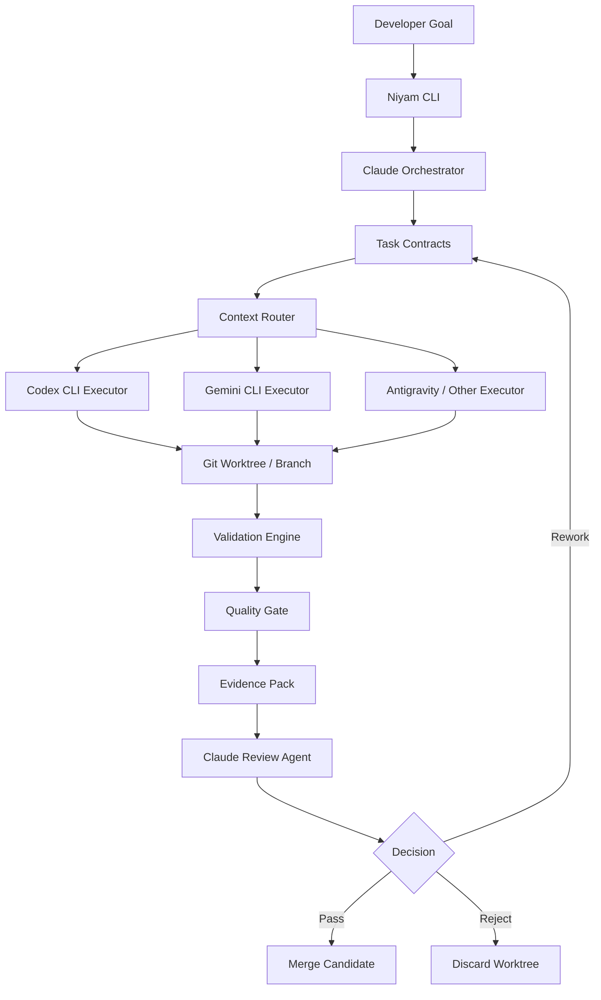

# Niyam Roadmap & Target Architecture

## Yes — this should become a **core Niyam capability** 🚀

Not a side feature. This is exactly the problem Niyam should solve:

> **Coordinate multiple AI coding agents while reducing token waste, enforcing quality gates, and keeping development auditable.**

Niyam should become the **AI Development Orchestrator** sitting above Claude Code, Codex CLI, Gemini CLI, Antigravity, local scripts, Git, and CI/CD.

---

# 1. Niyam positioning

## Current problem

Developers using Claude Code, Codex, Gemini, or Antigravity often face:

| Problem                                   | Impact                               |
| ----------------------------------------- | ------------------------------------ |
| Claude reads too much context             | High token cost                      |
| Same files get reread repeatedly          | Waste and latency                    |
| Agents make broad/uncontrolled changes    | Quality risk                         |
| No clear task boundary                    | Hard to validate                     |
| No deterministic quality gate             | Human has to inspect everything      |
| Multiple agents cannot coordinate cleanly | Duplicate work                       |
| No audit trail                            | Hard to trust in enterprise settings |

## Niyam’s answer

**Niyam = Orchestration + Task Control + Token Governance + Validation Layer**

```text
Claude defines.
Codex/Gemini build.
Niyam controls.
CI validates.
Claude reviews only evidence.
```

This is a very strong product direction.

---

# 2. Niyam target architecture



---

# 3. What Niyam should own

Niyam should not try to replace Claude, Codex, Gemini, or CI tools.

It should **control the workflow**.

## Niyam responsibilities

| Area          | Niyam responsibility                               |
| ------------- | -------------------------------------------------- |
| Planning      | Ask Claude to break work into task contracts       |
| Context       | Provide only relevant files/context to executors   |
| Execution     | Run Codex/Gemini/Antigravity against bounded tasks |
| Isolation     | Create branch/worktree per task                    |
| Validation    | Run lint, typecheck, tests, security checks        |
| Review        | Ask Claude to review only diff + evidence          |
| Token control | Track model usage and prevent context bloat        |
| Audit         | Store task, prompt, diff, logs, verdict            |
| Governance    | Enforce allowed files, risk levels, approvals      |

---

# 4. Core Niyam concept: **Task Contract**

This should become the central primitive in Niyam.

Every AI coding task should be represented as a contract.

```yaml
id: TASK-001
title: Add profile API validation
risk: medium
owner: bhushan

objective: >
  Add server-side validation for profile updates.

allowed_files:
  - services/api/routes/profile.py
  - services/api/models/profile.py
  - services/api/tests/test_profile.py

blocked_files:
  - services/api/auth/*
  - infra/*
  - package.json

acceptance_criteria:
  - Empty display name is rejected
  - Display name longer than 80 characters is rejected
  - Invalid timezone is rejected
  - Existing API response remains backward compatible
  - Unit tests pass

validation:
  commands:
    - pytest services/api/tests/test_profile.py
    - ruff check services/api
    - mypy services/api

executor:
  preferred: codex
  fallback: gemini

review:
  reviewer: claude
  review_inputs:
    - git_diff
    - test_output
    - executor_summary
```

This makes Niyam deterministic.

---

# 5. Niyam command model

## MVP command set

```bash
niyam init
niyam plan "Add user profile validation"
niyam run TASK-001 --executor codex
niyam validate TASK-001
niyam review TASK-001 --reviewer claude
niyam status
```

## Later command set

```bash
niyam run TASK-001 --executor gemini
niyam run-phase PHASE-01 --parallel
niyam compare TASK-001 --executors codex,gemini
niyam budget
niyam evidence TASK-001
niyam approve TASK-001
niyam merge TASK-001
```

---

# 6. Recommended Niyam workflow

## Step 1 — Developer gives goal

```bash
niyam plan "Build login audit trail and admin dashboard"
```

Claude is used only for planning.

Niyam asks Claude to generate:

```text
PHASE-001
TASK-001
TASK-002
TASK-003
TASK-004
```

Each task includes:

* objective
* allowed files
* blocked files
* acceptance criteria
* test commands
* risk level
* executor recommendation

---

## Step 2 — Niyam creates isolated worktrees

```bash
niyam run TASK-001 --executor codex
```

Internally:

```text
Creates branch: ai/TASK-001
Creates worktree: .niyam/worktrees/TASK-001
Runs Codex only inside that worktree
Captures summary, diff, logs
```

---

## Step 3 — Codex/Gemini implements

Codex or Gemini gets only:

```text
TASK-001 contract
Relevant project instructions
Allowed file list
Validation commands
```

Not the full project history.

---

## Step 4 — Niyam validates deterministically

```bash
niyam validate TASK-001
```

Runs:

```bash
npm run lint
npm run typecheck
npm test
semgrep scan
gitleaks detect
```

Depending on project config.

---

## Step 5 — Claude reviews evidence only

```bash
niyam review TASK-001 --reviewer claude
```

Claude receives:

```text
1. Task contract
2. Git diff
3. Test result
4. Changed file list
5. Executor summary
6. Validation failures, if any
```

Claude does **not** reread the whole repo.

This is where token savings happen.

---

# 7. Niyam internal folder structure

```text
repo/
├── niyam.yaml
├── CLAUDE.md
├── AGENTS.md
├── .niyam/
│   ├── context/
│   │   ├── project-brief.md
│   │   ├── architecture.md
│   │   ├── coding-standards.md
│   │   └── validation-policy.md
│   ├── tasks/
│   │   ├── TASK-001.yaml
│   │   ├── TASK-002.yaml
│   │   └── TASK-003.yaml
│   ├── runs/
│   │   └── TASK-001/
│   │       ├── prompt.md
│   │       ├── executor-summary.md
│   │       ├── diff.patch
│   │       ├── changed-files.txt
│   │       ├── lint.log
│   │       ├── test.log
│   │       ├── token-usage.json
│   │       └── review-verdict.md
│   ├── worktrees/
│   │   └── TASK-001/
│   ├── policies/
│   │   ├── scope-policy.yaml
│   │   ├── risk-policy.yaml
│   │   └── validation-policy.yaml
│   └── templates/
│       ├── task-contract.yaml
│       ├── review-prompt.md
│       └── executor-prompt.md
```

---

# 8. `niyam.yaml` example

```yaml
project:
  name: manan-web
  type: nextjs-fastapi
  default_branch: main

orchestrator:
  planner: claude
  reviewer: claude

executors:
  codex:
    enabled: true
    role: primary_implementation
    sandbox: workspace-write
  gemini:
    enabled: true
    role: reviewer_and_test_generator
  antigravity:
    enabled: false
    role: alternative_executor

context:
  max_files_per_task: 8
  include_architecture_summary: true
  include_full_file_content: false
  diff_review_only: true

validation:
  commands:
    lint: npm run lint
    typecheck: npm run typecheck
    test: npm test
  security:
    gitleaks: true
    semgrep: true

policy:
  block_unlisted_file_changes: true
  require_tests_for_code_changes: true
  require_review_for_medium_risk: true
  require_human_approval_for_high_risk: true

budget:
  max_claude_review_tokens: 12000
  max_executor_iterations: 3
  stop_on_repeated_failure: true
```

---

# 9. Niyam MVP modules

## Phase 1 — Local orchestration MVP

Build this first.

```text
niyam init
niyam plan
niyam run
niyam validate
niyam review
niyam status
```

### Capability

| Feature                              | MVP?  |
| ------------------------------------ | ----- |
| Create `.niyam` structure            | ✅     |
| Generate task contracts using Claude | ✅     |
| Run Codex against task               | ✅     |
| Run Gemini against task              | ✅     |
| Capture diff/test logs               | ✅     |
| Claude review from evidence pack     | ✅     |
| Basic token usage tracking           | ✅     |
| Worktree per task                    | ✅     |
| Parallel execution                   | Later |
| UI dashboard                         | Later |
| GitHub PR integration                | Later |

---

## Phase 2 — Quality and governance

Add:

```text
scope enforcement
risk scoring
blocked file policy
security scan integration
test coverage check
review verdict model
```

Claude should output verdict as:

```yaml
verdict: PASS
confidence: high
issues: []
required_changes: []
risk_notes:
  - No migration files changed
  - API compatibility preserved
```

Or:

```yaml
verdict: REWORK_REQUIRED
confidence: medium
issues:
  - Missing test for invalid timezone
  - Error response shape differs from existing API standard
required_changes:
  - Add negative timezone test
  - Reuse existing ErrorResponse model
```

---

## Phase 3 — Parallel agent execution

This is where Niyam becomes powerful.

```bash
niyam run-phase PHASE-01 --parallel
```

Example:

| Task                 | Executor        |
| -------------------- | --------------- |
| Backend API          | Codex           |
| Unit tests           | Gemini          |
| Frontend form update | Codex           |
| Docs update          | Gemini          |
| Security review      | Claude subagent |

Niyam should prevent collisions by checking file overlap.

```text
TASK-001 changes backend files
TASK-002 changes frontend files
TASK-003 changes docs
```

If two tasks touch the same files, Niyam should mark them as **serial only**.

---

## Phase 4 — Product-grade Niyam

Add:

```text
GitHub PR integration
Azure DevOps integration
web dashboard
team policies
cost dashboard
agent performance analytics
prompt/version audit
enterprise approval workflow
```

This aligns very strongly with your platform engineering and governance background.

---

# 10. Token reduction design inside Niyam

## Token budget rules

Niyam should enforce:

| Rule                                | Purpose                                |
| ----------------------------------- | -------------------------------------- |
| Claude only plans/reviews           | Prevent expensive implementation loops |
| Executors receive bounded contracts | Reduce context size                    |
| Review uses diff only               | Avoid rereading full files             |
| Logs are summarized before review   | Avoid huge test output                 |
| `CLAUDE.md` kept minimal            | Avoid always-loaded bloat              |
| Long rules moved into scoped files  | Load only when needed                  |
| Task contracts declare file scope   | Prevent repo wandering                 |
| Failed task retries capped          | Avoid infinite loops                   |

---

# 11. Niyam should maintain an evidence pack

For every task:

```text
.niyam/runs/TASK-001/evidence.md
```

Example:

```md
# Evidence Pack — TASK-001

## Objective
Add profile API validation.

## Executor
Codex CLI

## Changed Files
- services/api/routes/profile.py
- services/api/tests/test_profile.py

## Validation
| Check | Result |
|---|---|
| Lint | Pass |
| Typecheck | Pass |
| Unit tests | Pass |
| Scope check | Pass |

## Diff Summary
- Added validation for display name length
- Added timezone validation
- Added 5 unit tests

## Review Verdict
PASS

## Risk Notes
- No database migration
- No auth logic modified
- API error response shape preserved
```

This is excellent for enterprise trust.

---

# 12. Key Niyam differentiator

Most AI coding tools focus on:

```text
Generate code faster.
```

Niyam should focus on:

```text
Generate controlled, validated, auditable code changes with lower token cost.
```

That is a better enterprise-grade angle.

---

# 13. Updated Niyam product statement

Use this:

> **Niyam is an AI development orchestration CLI that coordinates Claude, Codex, Gemini, and other coding agents through task contracts, isolated execution, deterministic validation, and evidence-based review. It reduces token consumption, prevents uncontrolled code changes, and gives engineering teams an auditable way to use AI coding agents safely.**

Excellent positioning. Very sellable. ⚡

---

# 14. Recommended Niyam MVP backlog

## Epic 1 — Project initialization

### Story 1.1 — `niyam init`

Creates:

```text
niyam.yaml
.niyam/
.niyam/tasks/
.niyam/runs/
.niyam/context/
.niyam/policies/
.niyam/templates/
```

Acceptance criteria:

* Works in existing Git repo
* Does not overwrite existing files without confirmation
* Generates default config
* Detects project type where possible

---

## Epic 2 — Task contract generation

### Story 2.1 — `niyam plan`

Input:

```bash
niyam plan "Add onboarding flow"
```

Output:

```text
.niyam/tasks/TASK-001.yaml
.niyam/tasks/TASK-002.yaml
.niyam/tasks/TASK-003.yaml
```

Acceptance criteria:

* Claude generates bounded tasks
* Each task has acceptance criteria
* Each task has validation commands
* Each task has allowed files
* Each task has risk level

---

## Epic 3 — Executor adapter

### Story 3.1 — Codex executor

```bash
niyam run TASK-001 --executor codex
```

Acceptance criteria:

* Reads task contract
* Creates worktree
* Invokes Codex
* Captures summary
* Captures diff
* Captures command output

### Story 3.2 — Gemini executor

```bash
niyam run TASK-001 --executor gemini
```

Acceptance criteria:

* Reads task contract
* Invokes Gemini
* Captures JSON output
* Supports review/test-generation mode

---

## Epic 4 — Validation engine

### Story 4.1 — `niyam validate`

Acceptance criteria:

* Runs configured commands
* Saves logs
* Detects changed files
* Enforces allowed file scope
* Produces pass/fail result

---

## Epic 5 — Claude evidence review

### Story 5.1 — `niyam review`

Acceptance criteria:

* Sends only evidence pack to Claude
* No full repo context
* Produces structured verdict
* Supports `PASS`, `REWORK_REQUIRED`, `REJECT`

---

## Epic 6 — Task status tracking

### Story 6.1 — `niyam status`

Example output:

```text
TASK-001  READY_FOR_REVIEW     codex   tests:pass   risk:medium
TASK-002  VALIDATION_FAILED    gemini  tests:fail   risk:low
TASK-003  PLANNED              none    not-run      risk:high
```

---

# 15. MVP technology choice

I would build Niyam CLI in **TypeScript/Node.js** first.

Reason:

| Reason                         | Why                                |
| ------------------------------ | ---------------------------------- |
| CLI ecosystem is strong        | Commander, Yargs, Ink              |
| Works well with frontend later | Same language for CLI + dashboard  |
| Easy shell execution           | Spawn Codex/Gemini/Claude commands |
| JSON/YAML handling is simple   | Good for task contracts            |
| Cross-platform                 | macOS, Linux, Windows              |

Suggested stack:

```text
Language: TypeScript
CLI framework: Commander.js
Config: YAML
Validation: Zod
Process execution: execa
Git operations: simple-git
Logging: pino
Testing: vitest
Package manager: pnpm
```

---

# 16. Immediate next build sequence

Start with this order:

```text
1. niyam init
2. niyam plan
3. niyam run --executor codex
4. niyam validate
5. niyam review
6. niyam status
```

Do **not** start with dashboard, cloud backend, or marketplace.

First prove:

```text
Can Niyam reduce Claude token usage by delegating execution and reviewing only evidence?
```

That is the core MVP.

---

## Final answer

**Yes — incorporate this directly into Niyam.**

In fact, I would redefine Niyam MVP around this:

```text
Niyam MVP = AI coding-agent control plane
```

Core value:

```text
Plan with Claude.
Execute with Codex/Gemini.
Validate with deterministic checks.
Review with Claude using evidence only.
Track tokens, quality, and task state.
```

This gives Niyam a clear, sharp, high-value purpose: **safe, low-token, multi-agent software delivery orchestration**.
