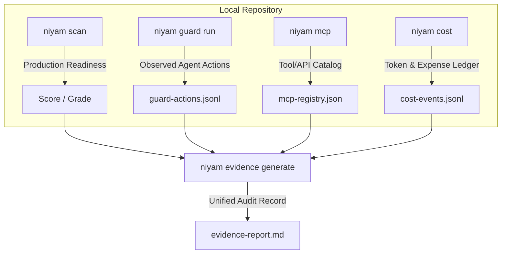

# Niyam Governance & Production Readiness Overview

> [!WARNING]
> The governance features introduced in v0.4.0 are currently **experimental**. Command-line parameters, log formats, and configuration schemas are subject to change.

Niyam provides a local-first, agent-agnostic **governance suite** to monitor, measure, and validate AI-assisted software development. It bridges the gap between fast "vibe coding" and the high standards of production software systems.

---

## 1. Core Pillars of Niyam Governance



Niyam's governance framework is built on five pillars:

### I. Repository Scanning (`niyam scan`)
Evaluates codebase readiness using configurable rulesets (`startup`, `team`, `enterprise`). It detects secrets exposure, unpinned Docker base images, missing dependency lockfiles, commented assertions, and missing health checkpoints.

### II. Guard Observation Mode (`niyam guard run`)
Runs shell commands under observation, logging exit codes, durations, directories, and timestamps. It automatically runs recursively to redact passwords, API keys, and credentials from log outputs.

### III. MCP & Tool Registry (`niyam mcp`)
Allows teams to declare, catalog, and audit the external APIs, CLI commands, and MCP servers accessible to AI agents. A heuristic classifier evaluates risk levels (low, medium, high, critical) based on capabilities and data access.

### IV. AI Cost Tracking (`niyam cost`)
Logs inputs, outputs, models, and session tokens to estimate expenses based on local rates tables (`.niyam/pricing.json`). It enables tracking budget wastage from failed or repeated tasks.

### V. Joint Evidence Report (`niyam evidence generate`)
Combines readiness scores, observed command logs, registered tool risks, and estimated session costs into a single markdown or HTML audit report.

---

## 2. Directory Structure & File Storage

All governance state is kept locally within your project directory:

```
.niyam/
├── niyam.yaml             ← Global governance configurations
├── mcp-registry.json      ← Registered tool and MCP database
├── pricing.json           ← Local pricing rates table for AI models
├── governance/
│   └── rules/             ← Custom YAML scanning rulesets
└── logs/
    ├── guard-actions.jsonl ← Audit log of observed command runs
    └── cost-events.jsonl   ← Log of token consumption events
```

---

## 3. How to Get Started

To initialize a project and execute a governance-checked flow:

1. **Verify your repository readiness:**
   ```bash
   niyam scan . --profile team
   ```
2. **Execute build commands under guard observation:**
   ```bash
   niyam guard run -- npm run build
   ```
3. **Register an MCP server and run a risk assessment:**
   ```bash
   niyam mcp register filesystem --type mcp_server --risk high --approved true
   niyam mcp risk-report
   ```
4. **Log cost metadata for your agent session:**
   ```bash
   niyam cost log --tool claude-code --model claude-3-5-sonnet --input-tokens 8500 --output-tokens 1200 --task "auth-fix"
   ```
5. **Compile the evidence report:**
   ```bash
   niyam evidence generate --output docs/evidence-report.md
   ```
