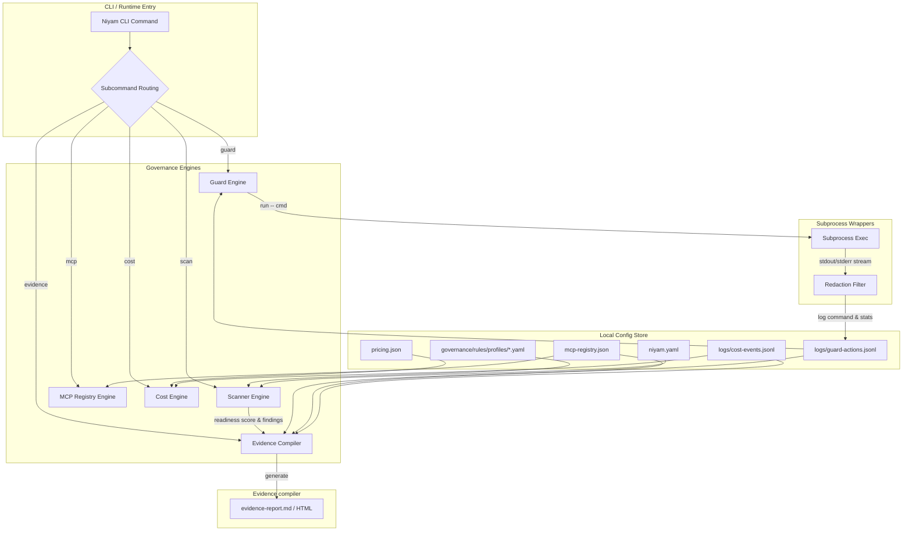

# Technical Architecture: Niyam Governance Suite

This document describes the technical architecture, data schemas, module boundaries, extension points, and local-first design principles of the Niyam Governance capabilities.

---

## 1. System Architecture Design

### Current vs. Target Architecture
* **Current Architecture (v0.3.x):** Niyam focused primarily on directory layout bootstrapping (`niyam init`) and checking test/lint validations (`niyam doctor`). It lacked runtime observation, risk rating registries, financial modeling, or unified audit trails.
* **Target Architecture (v0.4.x+):** Introduces a pipeline of five modular, decoupled governance engines. These operate locally on top of the `.niyam/` configuration store, intercepting agent actions, evaluating codebase states, and outputting evidence reports without introducing any cloud backend or network dependencies.



---

## 2. Module Boundaries & Namespaces

The Niyam repository codebase boundaries are strictly split between command-line handlers, core engines, and rule configurations:

* **CLI Interface (`niyam/cli/`):** Command-line routing using the `Typer` library. Registers subcommand routing for:
  - [scan.py](file:///Users/bhushan/Documents/Projects/sutra/niyam/cli/scan.py)
  - [guard.py](file:///Users/bhushan/Documents/Projects/sutra/niyam/cli/guard.py)
  - [mcp.py](file:///Users/bhushan/Documents/Projects/sutra/niyam/cli/mcp.py)
  - [cost.py](file:///Users/bhushan/Documents/Projects/sutra/niyam/cli/cost.py)
  - [evidence.py](file:///Users/bhushan/Documents/Projects/sutra/niyam/cli/evidence.py)
* **Core Business Engines (`niyam/core/`):** Contains the stateful execution logic and file parsing utilities.
  - [scan.py](file:///Users/bhushan/Documents/Projects/sutra/niyam/core/scan.py): Implements rules checking (file existence, regex, directory layout).
  - [security.py](file:///Users/bhushan/Documents/Projects/sutra/niyam/core/security.py): Implements subprocess shell wrappers, path freeze logic, and log redactions.
  - [mcp.py](file:///Users/bhushan/Documents/Projects/sutra/niyam/core/mcp.py): Manages tool configurations, approvals, and risk classifications.
  - [cost.py](file:///Users/bhushan/Documents/Projects/sutra/niyam/core/cost.py): Aggregates token inputs/outputs and computes USD session spending.
  - [evidence.py](file:///Users/bhushan/Documents/Projects/sutra/niyam/core/evidence.py): Aggregates findings and compiles reports.
* **Rules & Scoring Configuration (`niyam/governance/`):** Manages profiles, scoring limits, and output format templates.
  - [scoring.py](file:///Users/bhushan/Documents/Projects/sutra/niyam/governance/scoring.py): Computes the readiness score deduction logic.
  - [decision.py](file:///Users/bhushan/Documents/Projects/sutra/niyam/governance/decision.py): Evaluates readiness thresholds (GO / CONDITIONAL_GO / HIGH_RISK / NO_GO).
  - [rules/profiles/](file:///Users/bhushan/Documents/Projects/sutra/niyam/governance/rules/profiles/): Declarative profile configurations (startup, team, enterprise, regulated).

---

## 3. Data Schemas & Models

### A. Core Workspace Configuration (`.niyam/niyam.yaml`)
Stores global workspace options, active profiles, and active path freeze configurations.
```yaml
version: 0.4.0
project_name: my-governed-app
profile: team                  # startup | team | enterprise | regulated
runtimes:
  - claude
guard:
  enabled: true
  careful: true                # Warn on destructive shell commands
  frozen_paths:                # Read-only paths blocked from agent modifications
    - niyam/governance
    - tests/
```

### B. Tool Registry Catalog (`.niyam/mcp-registry.json`)
Tracks the external tools and Model Context Protocol (MCP) servers configured for agent use.
```json
{
  "schema_version": "1.0.0",
  "tools": {
    "local-filesystem": {
      "name": "local-filesystem",
      "type": "mcp_server",
      "command_or_url": "npx -y @modelcontextprotocol/server-filesystem /path/to/project",
      "owner": "Security Team",
      "risk_level": "high",
      "approved": true,
      "capabilities": ["read_file", "write_file", "list_dir"],
      "data_access": "Project workspace directories",
      "network_access": "none",
      "requires_approval": true,
      "notes": "Allows AI read/write modifications to project files"
    }
  }
}
```

### C. Rate Card Pricing File (`.niyam/pricing.json`)
Maps specific models to input/output token pricing per million.
```json
{
  "claude-3-5-sonnet": {
    "input_cost_per_million": 3.00,
    "output_cost_per_million": 15.00
  },
  "gpt-4o": {
    "input_cost_per_million": 5.00,
    "output_cost_per_million": 15.00
  },
  "gemini-1.5-pro": {
    "input_cost_per_million": 1.25,
    "output_cost_per_million": 5.00
  }
}
```

### D. Subprocess Command Logs (`.niyam/logs/guard-actions.jsonl`)
Append-only log recording actions executed under `niyam guard run`.
```json
{"timestamp": "2026-06-05T12:00:00Z", "session_id": "session-xyz", "actor_type": "agent", "tool": "shell", "action": "command_execute", "command": "npm run test", "cwd": "/project/sutra", "exit_code": 0, "duration_ms": 1450, "mode": "observe"}
```

### E. AI Token Transaction Ledger (`.niyam/logs/cost-events.jsonl`)
Tracks individual LLM interactions and session costs.
```json
{"timestamp": "2026-06-05T12:00:00Z", "session_id": "session-xyz", "task_id": "T1-governance-spec", "tool_name": "claude-code", "model": "claude-3-5-sonnet", "input_tokens": 12500, "output_tokens": 2400, "estimated_cost": 0.0735, "repo": "sutra", "branch": "feature/governance", "status": "success", "notes": "initial doc generation"}
```

---

## 4. Local-First Design Principles

Niyam is designed from the ground up to operate completely disconnected from external services:
* **Zero SaaS Dependencies:** Scoring rules, logs, cost tables, and registry databases reside entirely inside the local `.niyam/` workspace folder.
* **SQLite-Free Storage:** Niyam uses lightweight, plain text representation stores:
  - Declarative configuration via standard **YAML** parser.
  - Registry structures via standard **JSON** serialization.
  - Append-only telemetry logs using **JSON Lines (JSONL)** formats to ensure high-throughput file writes without file-locking bottlenecks.
* **Git Integrity Gating:** Guardrails integrate directly with native Git hooks (pre-commit, pre-push) to block non-compliant files locally, before they leave the developer machine.
* **Stream-Based I/O Redaction:** CLI command output captures stream directly through a string sanitization filter in-memory, ensuring raw secret keys are scrubbed before they touch local disk logs.

---

## 5. Extension Points

Niyam is structured to support customizations for unique organizational security mandates:

### A. Custom Rulesets & Scanners
You can define custom check rules using YAML declarations. Custom rules must specify a unique identifier, category, severity, and evaluation matcher.
Supported match types:
* `file_exists` / `file_missing`
* `filename_pattern` (Unix Glob)
* `directory_exists` / `directory_missing`
* `content_contains` / `content_regex` (Case-insensitive regular expressions)

*Example Custom Rule (`custom-rules.yaml`):*
```yaml
rules:
  - id: SEC-CUSTOM-KEY
    title: Custom Auth Header Check
    category: secrets
    severity: critical
    match_type: content_regex
    target: src/**/*.ts
    pattern: "X-Custom-Auth-Token:\\s*[A-Za-z0-9]+"
    description: "Detected hardcoded custom authorization headers."
    recommendation: "Load headers dynamically using environment variables."
```

### B. Custom Rules Profiles
You can extend or override default readiness profiles. By adding files under `.niyam/governance/rules/profiles/`, they are automatically detected and available to the `--profile` option in `niyam scan`.

### C. External Scanner Integrations
The core validation pipeline ([external_scanners.py](file:///Users/bhushan/Documents/Projects/sutra/niyam/core/external_scanners.py)) executes third-party CLI tools (e.g., Gitleaks, Semgrep, Trivy, Checkov) if present on the host environment and merges their findings into the final readiness report. To add a new scanner integration:
1. Define a class inheriting from `BaseScanner`.
2. Implement the `is_available()` check and `run_scan()` command-execution wrappers.
3. Register the scanner in the `SCANNER_REGISTRY` mapping.
