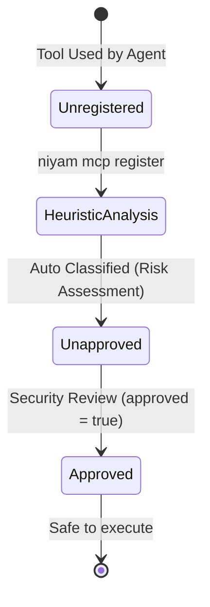

# Security & Access Governance Specification: Niyam Guard

This document outlines the security architecture, redaction mechanics, secrets handling policies, MCP risk classifications, data retention models, and offline operations of Niyam Guard.

---

## 1. Secrets Handling & Redaction Engine

Niyam integrates an inline redaction filter that streams terminal output logs and command arguments in-memory, scrubbing sensitive credentials before they can ever persist in local log files or be printed in evidence reports.

### Secrets Detection Rules
The redaction engine evaluates text lines and command arguments against a list of regular expression patterns in [redaction.py](file:///Users/bhushan/Documents/Projects/sutra/niyam/governance/common/redaction.py):

| Target Credential | Regex Pattern | Replacement |
| --- | --- | --- |
| **AWS Access Key ID** | `(A3T[A-Z0-9]\|AKIA\|AGPA\|AIDA\|AROA\|ASCA\|ASIA)[A-Z0-9]{16}` | `[REDACTED_AWS_KEY]` |
| **AWS Secret Access Key** | `(?i)aws(.{0,20})?['\"][0-9a-zA-Z\/+]{40}['\"]` | `[REDACTED_AWS_SECRET]` |
| **Generic API Tokens** | `(?i)(token\|api_key\|apikey\|bearer\|passwd\|secret)\s*[:=]\s*['\"][^'\"]+['\"]` | `\1: [REDACTED_SECRET]` |
| **Private Keys (PEM/RSA)** | `-----BEGIN\s+([A-Z\s]+)\s+PRIVATE\s+KEY-----[\s\S]+?-----END\s+\1\s+PRIVATE\s+KEY-----` | `[REDACTED_PRIVATE_KEY]` |

### Stream Interception & Storage Lifecycle
When executing commands under `niyam guard run`:
1. Stdout and stderr bytes are read from the subprocess stream line-by-line using standard stream pipes.
2. The byte strings are decoded to UTF-8 (falling back to surrogate-escapes for binary content).
3. The redaction regexes run sequentially, replacing matches with redacted labels.
4. If the `--capture-output` flag is enabled, redacted outputs are written to the `.niyam/logs/guard-actions.jsonl` database. **Raw (unredacted) terminal output is never stored on disk.**

---

## 2. Guard Policy & Execution Control

Niyam Guard enforces policies that constrain developer and agent environments to prevent accidental or malicious actions.

### Policy Modes
When executing commands via `niyam guard run -- <command>`, Niyam operates in one of four modes (controlled by the `guard` config block in `niyam.yaml` or overridden via `--mode`):

1. **`observe` (Default):** Runs commands passively, recording execution duration, exit codes, and timestamps.
2. **`warn`:** Detects destructive patterns (e.g., shell formatting commands) or unapproved high-risk tools and prompts the developer to confirm execution.
3. **`approve`:** Halts commands until an explicit developer approval is received.
4. **`block`:** Hard-stops commands that violate path freeze rules, privilege scopes, or risk profile limits, exiting with `127` (Access Denied).

### Path Freeze Mechanics
* The directory lists to restrict are defined under `guard.frozen_paths` in `niyam.yaml`.
* **Pre-Execution Check:** Before spawning a subprocess, Niyam scans the command argument strings. If the command references, writes, or deletes a file inside a frozen directory, Niyam blocks the execution immediately.
* **Git Commit Enforcement:** Niyam installs pre-commit hooks that cross-reference modified files against frozen paths, rejecting commits containing staged changes inside restricted folders.

### Privilege Escalation & Host Escape Blocks
To prevent agents from modifying environments outside the repository root:
* Prefixing command inputs with `sudo` or `su` is blocked in `block` mode.
* Command arguments attempting directory traversals outside the repository root (e.g., trying to write to `/etc/passwd`) are detected and blocked.

---

## 3. Model Context Protocol (MCP) Risk Classification

To prevent agents from executing arbitrary capabilities via external tools, Niyam enforces strict access control policies on registered MCP servers.

### Heuristic Risk Classification
When registering a tool via `niyam mcp register <name>`, Niyam evaluates its capabilities and types to assign a heuristic risk rating:

* **`critical`:** Shell command executions, raw CLI execution capability (e.g., `bash`, `ssh`).
* **`high`:** Filesystem write access, database schema modification, root privilege operations.
* **`medium`:** Remote cloud API connections, read/write SaaS access (e.g., Slack, Jira, GitHub APIs).
* **`low`:** Static reference search tools, read-only documentation APIs.

### Whitelist & Review Flow
All tools must be cataloged in `.niyam/mcp-registry.json`. If an unapproved tool classified as `high` or `critical` is invoked by an agent, Niyam flags a policy warning in the joint evidence report.

---

## 4. Threat Modeling

Evaluating risks associated with Model Context Protocol (MCP) servers and external web APIs.

| Threat | Likelihood | Impact | Mitigation Strategy |
| --- | --- | --- | --- |
| **MCP Server Directory Escape** | Medium | High | Restrict filesystem MCP server arguments to the project root absolute path. Validate arguments before spawning. |
| **Credential Exposure in CLI Arguments** | High | Medium | Run arguments through the Redaction Pipeline before writing command histories to `guard-actions.jsonl`. |
| **Unauthorized SaaS API Write** | Low | High | Enforce heuristic reviews during `niyam mcp register`. Warn on SaaS endpoints with unapproved write capabilities. |
| **Agent Executing Host Terminal Scripts** | Medium | Critical | Prohibit raw bash/zsh tools from running without developer approval prompts (`niyam guard careful`). |

---

## 5. Audit Logging & Verification

Every command executed, readiness scan run, and cost event logged is captured in append-only **JSON Lines (JSONL)** formats:
* **Integrity Audit:** Niyam records cryptographic SHA-256 hashes of the files scanned and the evidence compiled.
* **Cryptographic CI Verification:** When running `niyam ci verify`, Niyam verifies that the local logs have not been retroactively altered or deleted, ensuring a secure audit trail for compliance teams.

---

## 6. Data Retention & Log Pruning

Because Niyam runs local-first, it implements storage limits to prevent log bloating inside the developer workspace:
* **Log File Cap:** Individual JSONL log files (`guard-actions.jsonl` and `cost-events.jsonl`) are capped at **50 MB** or **100,000 entries** by default.
* **Auto-Pruning:** When limits are reached, Niyam prunes the oldest 10% of entries, maintaining a compact local footprint.
* **Clean Subcommand:** Developers can run `niyam clean` to purge old session records while preserving configuration parameters.

---

## 7. Offline Operations & Network Isolation

Niyam enforces complete network isolation for privacy and compliance:
* **Offline Execution:** The scanner, policy engine, and evidence compiler require no internet connection.
* **Local Rate Tables:** Model token costs are calculated entirely using the offline rate card in `.niyam/pricing.json`.
* **Mock Fallbacks:** If external scanners (like Gitleaks or Semgrep) are missing, Niyam skips them gracefully, detailing installation options rather than failing or reaching out to external networks to download dependencies.
