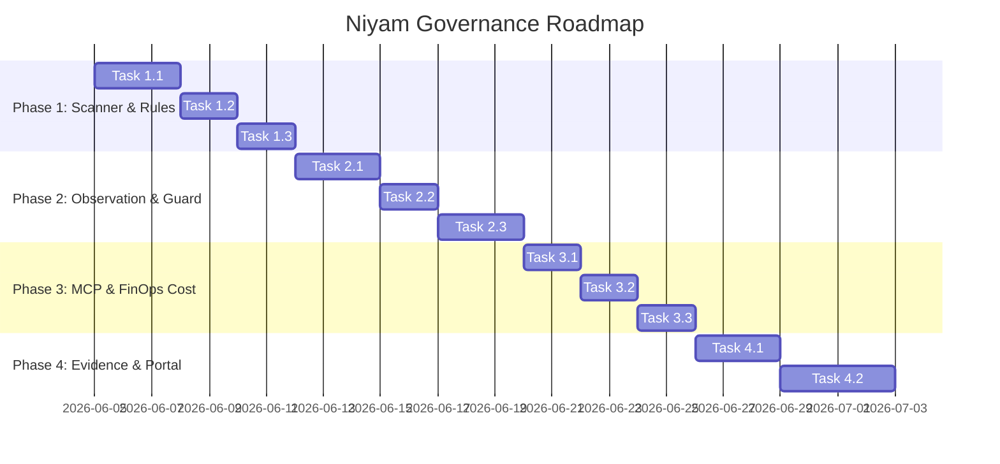

# Feature Implementation Ticket List

This document catalogs the governance features, organized into Epic structures, mapped to target releases, and containing specific acceptance and test criteria.

---

## Current Status

As of 2026-06-09, the original governance roadmap items below are implemented
and validated against their listed test suites. The project version is now
tracking `1.0.0-rc1`, so the `v0.4.0-*` release mapping is retained as
historical planning context rather than the active release train.

Validation run:

```bash
pytest tests/test_rules.py tests/test_readiness_scoring.py tests/e2e/test_scan_e2e.py tests/test_guard_observe.py tests/test_redaction.py tests/test_path_freeze.py tests/e2e/test_mcp_e2e.py tests/test_cost.py tests/e2e/test_evidence_e2e.py tests/test_scan_ci_gates.py tests/test_mission.py tests/test_parallelism.py tests/test_swarm.py tests/test_fleet_cli.py tests/test_pr.py
```

Result:

```text
144 passed, 1 warning in 75.95s
```

### Research Inputs for Active Roadmap

The active roadmap is now guided by the implemented validation surface plus
current AI/software-supply-chain governance guidance:

- NIST AI RMF: govern, map, measure, and manage AI risk through evidence-backed
  controls.
- NIST AI RMF Generative AI Profile: account for generative-AI-specific
  operational risks.
- OWASP Agentic Skills Top 10: govern agent skills with inventory, approval,
  least privilege, isolation, monitoring, and incident response.
- OpenSSF SLSA: improve release artifact provenance and supply-chain integrity.
- OpenSSF Scorecard: measure repository security posture through automated
  checks.

References:

- https://www.nist.gov/itl/ai-risk-management-framework
- https://owasp.org/www-project-agentic-skills-top-10/
- https://slsa.dev/
- https://openssf.org/projects/scorecard/

### Active Pending Items

| Priority | Item | Deliverables | Validation |
| --- | --- | --- | --- |
| P0 | `1.0.0-rc1` release readiness | Release notes, CLI reference refresh, package/install smoke, examples refresh, full-suite validation. | Full pytest suite, package build/install smoke, CLI help smoke. |
| P1 | Dashboard/operator evidence UX | Local API/dashboard views for scan, guard, MCP, cost, evidence, mission, swarm, fleet, and PR evidence. | API tests, dashboard smoke tests, generated evidence fixture review. |
| P1 | CI/CD and supply-chain hardening | Hardened GitHub Actions/Azure DevOps templates, evidence artifacts, provenance/SBOM/signing plan, Scorecard/SLSA alignment. | CI template tests, artifact integrity tests, package provenance smoke where available. |
| P1 | Task-contract canonical model | Versioned schema, validation, persisted task state, risk/approval fields, retry policy, evidence embedding. | Contract schema tests, mission lifecycle tests, boundary enforcement tests. |
| P2 | Agent skill/tool governance | Skill registry, permission manifests, version pinning, provenance metadata, approvals, network/filesystem restrictions, scan rules. | Registry tests, policy tests, malicious/over-privileged skill fixtures. |
| P2 | Enterprise policy workflows | Team policies, approval roles, policy exceptions, prompt/version audit, risk acceptance. | Policy evaluation tests, approval workflow tests, evidence output tests. |
| P3 | Fleet-level mission dispatch | Cross-repo dispatch, dependency-aware ordering, fleet dashboard, evidence rollups. | Fleet e2e tests, failure isolation tests, dashboard/API tests. |
| P3 | Agent performance analytics | Agent/runtime scorecards, cost per accepted task, retry/failure analytics, trend views. | Analytics aggregation tests, fixture reports, dashboard/API tests. |

### AgentOps Development Phases

The active roadmap integrates the proposed AgentOps strategy without breaking the
current Niyam structure. Memory Ledger extends the existing `niyam memory`
surface. Control Room builds on current `mission`, `portal`, `guard`, `swarm`,
`mcp`, and `evidence` modules before introducing any new command group.

| Phase | Scope | Current modules to extend | Compatibility guardrail |
| --- | --- | --- | --- |
| A | Documentation and release alignment | `README.md`, `ROADMAP.md`, `docs/cli-reference.md` | No runtime behavior changes. |
| B | Memory Ledger core | `niyam/cli/memory.py`, `niyam/core/memory.py`, `.niyam/memory/index.jsonl` | Complete; preserve `niyam memory show/add/clear`. |
| C | Memory policy, redaction, and lineage | `niyam/core/memory.py`, redaction utilities, evidence fixtures | Complete; memory findings are additive and opt-in. |
| D | MCP-compatible memory server | `niyam mcp`, new `niyam/mcp/memory_server.py` | Complete; default path remains local-first with no external service dependency. |
| E | Control Room MVP | `workspace`, `mission`, `portal`, `evidence` | Complete; introduced `niyam workspace` as CLI foundation. |
| F | Browser sandbox and human takeover | Portal/API, guard/policy primitives, workspace artifacts | Browser workflow is narrow, sandboxed, and test-gated. |
| G | Evidence and portal integration | `niyam evidence`, portal templates/API | Existing `scan,guard,mcp,cost` evidence output remains unchanged. |
| H | Enterprise and fleet expansion | `fleet`, policy, approvals, evidence, SaaS API | Backward compatibility tests remain required. |

Open decision:

- `niyam workspace` is a candidate future Control Room command group. It should
  not be added until the CLI shape is validated against existing `mission` and
  `portal` workflows.

---

## Phased Roadmap Overview



---

## Release Mapping Table

| Epic ID | Epic Name | Scope Summary | Target Release | Release Channel |
| --- | --- | --- | --- | --- |
| **EPIC-001** | Scanner Core & YAML Rules | Rule evaluation engine, readiness profiles, and scoring deductions. | `v0.4.0-alpha.1` | Alpha |
| **EPIC-002** | Action Governance & Guard | Subprocess interception, secrets redaction, and path freezes. | `v0.4.0-alpha.2` | Alpha |
| **EPIC-003** | MCP Registry & Cost FinOps | Tool catalogs, risk classifications, pricing rate cards. | `v0.4.0-beta.1` | Beta |
| **EPIC-004** | Joint Evidence Report | Markdown/HTML/SARIF report compiler and CI/CD verifications. | `v0.4.0-rc.1` | Release Candidate |
| **EPIC-005** | Production Release | Stable package packaging and documentation. | `v0.4.0` | GA Stable |

Current active release target: `1.0.0-rc1`.

---

## Phase 1: Scanner Core & YAML Rules (EPIC-001)

Status: complete and validated.

### Ticket 1.1: Core Match Types Engine
* **Status:** Complete
* **Type:** Feature (Core)
* **Title:** Implement 7 Core Match Types for Scanner Engine
* **Description:** Add full evaluation logic in `niyam/core/scan.py` for matching methods: `file_exists`, `file_missing`, `filename_pattern`, `content_contains`, `content_regex`, `directory_exists`, and `directory_missing`.
* **Acceptance Criteria:**
  1. `filename_pattern` matches files using standard Unix glob rules.
  2. `content_regex` runs case-insensitive searches inside allowed text files.
  3. Binary files must be skipped during full content inspections.
* **Test Criteria:**
  - **Unit Tests:** Execute `pytest tests/test_rules.py` validating each match type against file fixtures.
  - **E2E Validation:** Verify in [test_scan_e2e.py](file:///Users/bhushan/Documents/Projects/sutra/tests/e2e/test_scan_e2e.py) that a scanned workspace yields the expected findings based on file layout rules.
* **Dependencies:** None
* **Estimated Effort:** 3 Story Points

### Ticket 1.2: Profile Configs & Deduction Scoring
* **Status:** Complete
* **Type:** Feature (Core)
* **Title:** Implement Scan Profiles and Severity Deduction Logic
* **Description:** Parse YAML profile rules files (`startup.yaml`, `team.yaml`, `enterprise.yaml`, `regulated.yaml`). Implement the scoring algorithm subtracting weights from $100$ and returning launch status labels.
* **Acceptance Criteria:**
  1. Deductions compute correctly (Critical = 25, High = 15, Medium = 8, Low = 3, Info = 0).
  2. Returns the correct decision code: `GO` (>=90), `CONDITIONAL_GO` (75-89), `HIGH_RISK` (50-74), and `NO_GO` (<50).
* **Test Criteria:**
  - **Unit Tests:** Run `pytest tests/test_readiness_scoring.py` to assert mathematical correctness of score deductions and boundary scores (e.g., score of 49 mapping to `NO_GO`).
* **Dependencies:** Ticket 1.1
* **Estimated Effort:** 2 Story Points

### Ticket 1.3: CLI `niyam scan` Command Updates
* **Status:** Complete
* **Type:** Feature (CLI)
* **Title:** Enhance `niyam scan` Command Options and Exporters
* **Description:** Implement Typer options (`--profile`, `--output`, `--rules`, `--report-file`, `--fail-on`) in `niyam/cli/scan.py` and print tabular outcomes using the `rich` console.
* **Acceptance Criteria:**
  1. `niyam scan . --output json` dumps parseable findings schema.
  2. `--report-file` writes formatted markdown or SARIF reports to target destinations.
* **Test Criteria:**
  - **E2E Validation:** Execute `pytest tests/e2e/test_scan_e2e.py` to assert scan commands exit with `0` on clean fixtures and `2` on failing profiles.
* **Dependencies:** Ticket 1.2
* **Estimated Effort:** 2 Story Points

---

## Phase 2: Action Governance & Subprocess Hook (EPIC-002)

Status: complete and validated.

### Ticket 2.1: Subprocess Wrapper execution (`niyam guard run`)
* **Status:** Complete
* **Type:** Feature (Core)
* **Title:** Implement Command Observation Subprocess execution Wrapper
* **Description:** Write wrapper engine in `niyam/core/security.py` that spawns commands inside a subprocess, records duration/exit codes, and appends records to `.niyam/logs/guard-actions.jsonl`.
* **Acceptance Criteria:**
  1. Wraps commands containing piping and flags (e.g. `niyam guard run -- npm test`).
  2. Records execution durations to millisecond accuracy.
* **Test Criteria:**
  - **Integration Tests:** Verify command logging details and exit code preservation using `pytest tests/test_guard_observe.py`.
* **Dependencies:** None
* **Estimated Effort:** 3 Story Points

### Ticket 2.2: Stream Redaction Pipeline
* **Status:** Complete
* **Type:** Feature (Core)
* **Title:** Implement Regex Secret Redaction Pipeline
* **Description:** Run captured stdout/stderr streams and arguments through regex patterns to filter keys, tokens, and authorization parameters.
* **Acceptance Criteria:**
  1. AWS keys and generic private keys are replaced with appropriate redacted strings.
  2. Raw stdout capture is disabled by default unless `--capture-output` is toggled.
* **Test Criteria:**
  - **Unit Tests:** Execute `pytest tests/test_redaction.py` asserting that hardcoded credentials are replaced with `[REDACTED]` tokens in logs and reports.
* **Dependencies:** Ticket 2.1
* **Estimated Effort:** 2 Story Points

### Ticket 2.3: Active Path Freeze Engine
* **Status:** Complete
* **Type:** Feature (Core)
* **Title:** Implement Path Freeze Checks and Git Commit Block Hooks
* **Description:** Build validation interceptors that block subprocess commands or git commits from modifying files defined under `guard.frozen_paths`.
* **Acceptance Criteria:**
  1. Pre-execution checks raise hard failures (exit code 127) if edit commands target frozen paths.
  2. Git pre-commit script halts runs if staged files contain edits inside frozen folders.
* **Test Criteria:**
  - **Integration Tests:** Run `pytest tests/test_path_freeze.py` to verify commands targeting frozen paths are blocked with exit code `127`.
* **Dependencies:** Ticket 2.1
* **Estimated Effort:** 3 Story Points

---

## Phase 3: MCP & FinOps Cost Engine (EPIC-003)

Status: complete and validated.

### Ticket 3.1: Tool Registry Risk Classifier
* **Status:** Complete
* **Type:** Feature (Core)
* **Title:** Implement MCP Tool Registry JSON store and Risk Classifier Heuristics
* **Description:** Develop file operations for `.niyam/mcp-registry.json`. Write classifier rules assigning risks (`low` to `critical`) depending on capabilities and types.
* **Acceptance Criteria:**
  1. `niyam mcp register` adds tools and saves configurations safely.
  2. Tools requesting command executions default to `critical` risk rating.
* **Test Criteria:**
  - **E2E Validation:** Execute [test_mcp_e2e.py](file:///Users/bhushan/Documents/Projects/sutra/tests/e2e/test_mcp_e2e.py) to confirm registration, risk cataloging, listing, and approval states.
* **Dependencies:** None
* **Estimated Effort:** 2 Story Points

### Ticket 3.2: Cost Logging & Pricing Config
* **Status:** Complete
* **Type:** Feature (Core)
* **Title:** Build Token Cost Logger and pricing JSON Setup
* **Description:** Log usage parameters to `.niyam/logs/cost-events.jsonl` and calculate USD costs against lookup rate entries inside `.niyam/pricing.json`.
* **Acceptance Criteria:**
  1. Automatically creates default pricing structures if `.niyam/pricing.json` is missing.
  2. Correctly logs estimated costs using prompt/completion token weights.
* **Test Criteria:**
  - **Unit Tests:** Execute `pytest tests/test_cost.py` to verify calculations and rates loading.
* **Dependencies:** None
* **Estimated Effort:** 2 Story Points

### Ticket 3.3: FinOps Summary Report Command
* **Status:** Complete
* **Type:** Feature (CLI)
* **Title:** Implement CLI Commands for Cost Summaries and Spend Reports
* **Description:** Write calculations grouping spending metrics by day, repository, and task. Highlight budget wastage.
* **Acceptance Criteria:**
  1. `niyam cost summary` prints total token counts and USD expenses.
  2. `niyam cost report` outputs detailed tables showing wasted spends.
* **Test Criteria:**
  - **Integration Tests:** Run `pytest tests/test_cost.py` to verify summary and report formatting output.
* **Dependencies:** Ticket 3.2
* **Estimated Effort:** 2 Story Points

---

## Phase 4: Joint Evidence Compiler & CI/CD Verification (EPIC-004)

Status: evidence compiler and CI gate behavior are complete and validated. The
remaining roadmap work is dashboard/operator UX and release packaging polish.

### Ticket 4.1: Evidence Compiler Engine
* **Status:** Complete
* **Type:** Feature (Core)
* **Title:** Implement Unified Evidence Report Compiler
* **Description:** Develop compiler logic assembling scanner scores, audit trails, and registered tool risks into Markdown, JSON, or HTML formats.
* **Acceptance Criteria:**
  1. Missing sections (e.g. no guard actions) must be skipped gracefully.
  2. Outputs contain no unmasked credentials or passwords.
* **Test Criteria:**
  - **E2E Validation:** Execute [test_evidence_e2e.py](file:///Users/bhushan/Documents/Projects/sutra/tests/e2e/test_evidence_e2e.py) asserting that the compiler generates reports incorporating all data metrics.
* **Dependencies:** Ticket 1.3, Ticket 2.2, Ticket 3.1, Ticket 3.3
* **Estimated Effort:** 3 Story Points

### Ticket 4.2: CI/CD Verify Gating Command (`niyam ci verify`)
* **Status:** Complete for CI gate behavior; dashboard/operator UX remains active next-phase work.
* **Type:** Feature (CLI)
* **Title:** Implement CI Command Gating and Exit Validation
* **Description:** Build `niyam ci verify` to read files scanned, evidence generated, and cryptographic signatures of the execution context to verify compliance.
* **Acceptance Criteria:**
  1. Exit code `0` is returned if the workflow complies with rules and contains valid evidence.
  2. Exit code `2` or higher is returned on integrity failures.
* **Test Criteria:**
  - **Integration Tests:** Run `pytest tests/test_scan_ci_gates.py` to verify the gating mechanism handles strict and lenient modes properly.
* **Dependencies:** Ticket 4.1
* **Estimated Effort:** 3 Story Points
