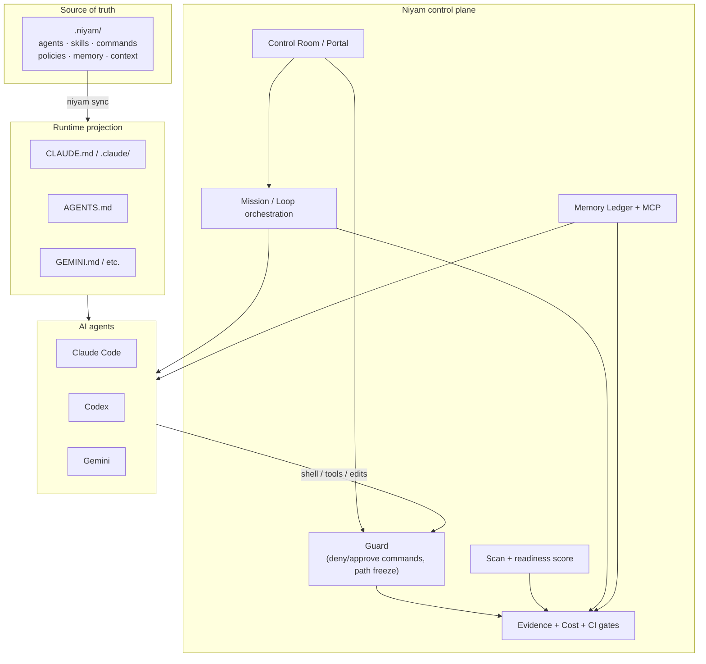
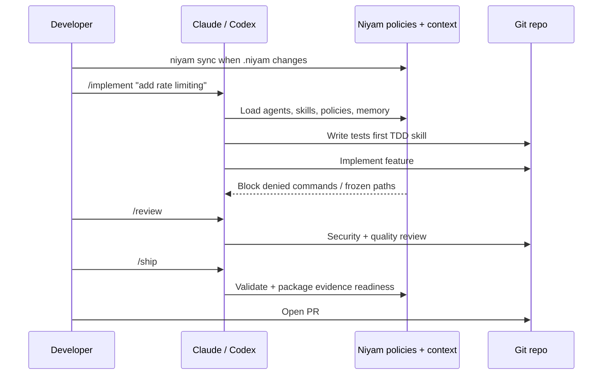
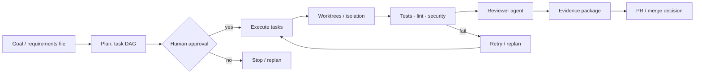
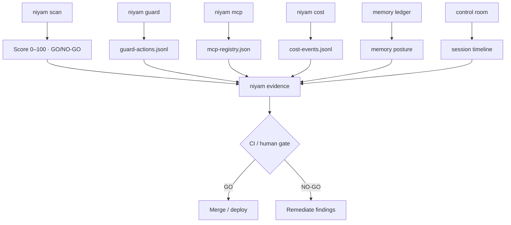

# Niyam User Guide

**How to use Niyam day to day — mental model, setup, workflows, and command map.**

Niyam is an open-source **AgentOps control plane** for governed autonomous AI development. It is not another coding agent. It sits around Claude Code, Codex, Gemini, and similar runtimes so teams can define the rules, bound autonomy, and ship with evidence.

> One `.niyam/` source of truth. Many AI runtimes. Policy-driven autonomy. Portable memory. Evidence-backed delivery.

Related deep dives:

- [CLI Reference](cli-reference.md)
- [AgentOps Platform](agentops-platform.md)
- [Governance](governance.md)
- [Memory Ledger](memory-ledger.md)
- [Control Room](control-room.md)
- [MCP Memory Server](mcp-memory-server.md)
- [Browser Sandbox](browser-sandbox.md)

---

## 1. Mental model

| Layer | Role |
| --- | --- |
| **AI runtimes** (Claude, Codex, Gemini) | Write code, reason, use tools |
| **Niyam** | Rules, isolation, approvals, memory, cost, evidence |
| **Repo (`.niyam/`)** | Single source of truth projected into each runtime |

**Niyam owns the workflow.** Runtimes do the coding. Niyam plans/bounds tasks, enforces policy, tracks cost, and packages audit evidence.



---

## 2. Who uses Niyam

| Persona | Primary goal | Typical surface |
| --- | --- | --- |
| **Individual developer** | Safer day-to-day AI coding | `init` → `sync` → `/implement` `/review` `/ship` |
| **Tech lead / eng manager** | Bounded autonomous work, reviewable evidence | missions, dashboard, approvals, evidence packs |
| **Security / compliance** | GO/NO-GO, secrets, tool risk, audit trail | `scan`, `guard`, `mcp`, `evidence`, CI verify |
| **Platform / multi-repo** | Same governance across many services | fleet, packs, CI generators |

---

## 3. Install

**Global install (recommended):**

```bash
pipx install niyam
pipx upgrade niyam
```

**Run without installing:**

```bash
uvx --from niyam niyam --help
```

**Shell completion (Bash / Zsh / Fish / PowerShell):**

```bash
niyam completion install
```

---

## 4. First-time setup (every repo)

```text
Install → Init → Context → Sync → Doctor → Start coding
```

```bash
# 1. Enter the target repository
cd your-project

# 2. Bootstrap a governance profile + primary runtime
niyam init --profile fullstack --runtime claude

# 3. Scan the stack and refresh project context
niyam context refresh

# 4. Project .niyam/ into runtime files (CLAUDE.md, .claude/, AGENTS.md, …)
niyam sync

# 5. Validate configuration
niyam doctor
```

### Profiles

| Profile | Typical fit |
| --- | --- |
| `fullstack` | Full-stack product repos |
| `backend` | API / service services |
| `frontend` | UI-focused apps |
| `startup-saas` | Early product + shipping velocity |
| `platform-engineering` | Infra / platform teams |
| `governed-enterprise` | Stronger roles and release gates |

### What `init` creates under `.niyam/`

| Area | Purpose |
| --- | --- |
| **Agents** | Roles such as backend/frontend specialist, security/QA reviewer |
| **Skills** | Method packs (TDD, planning, secure review, repo context) |
| **Commands** | Slash workflows: `/implement`, `/review`, `/ship`, `/context-refresh` |
| **Policies** | Denied commands, approval areas, path freezes, evidence rules |
| **Context + memory** | Architecture notes, lessons, decisions, validation commands |
| **Logs** (later) | Guard actions, cost events, mission state |

### Optional next steps after init

```bash
niyam runtime add codex    # multi-runtime workspace
niyam pack add <pack>      # install capability packs
niyam setup                # interactive wizard
```

---

## 5. Day-to-day interactive development

This is the most common flow: **human + one agent**, with Niyam as guardrails and methodology.



### Habit loop

1. Keep the workspace synced after policy or pack changes: `niyam sync`.
2. Open your agent (for example `claude`) in the governed repo.
3. Prefer Niyam slash commands over free-form “just fix it”:

| Command | Intent |
| --- | --- |
| `/implement …` | Plan and implement with TDD-oriented skill |
| `/review` | Correctness, security, and quality review |
| `/ship` | Validate and prepare evidence / merge readiness |
| `/context-refresh` | Re-scan project context after large changes |

4. High-risk areas still need human approval by default: auth, payments, infrastructure, secrets, database migrations, production config, and CI/CD.

The agent is steered by projected files (`CLAUDE.md`, `AGENTS.md`, agent prompts, skills). Dangerous shell commands and sensitive paths are constrained by policy.

---

## 6. Autonomous missions (batch / multi-step work)

Use missions for migrations, large refactors, or multi-task goals.

```bash
# One-step plan + execute path (as available in your version)
niyam run "migrate all API endpoints to v2"

# Explicit lifecycle
niyam mission plan requirements/REQ-001.md
niyam mission validate-plan
niyam mission approve
niyam mission start
niyam dashboard --watch    # or: niyam portal
niyam mission report
```



### Expected mission behavior

1. **Plan** — Decompose the goal into task contracts (objective, allowed/blocked files, acceptance criteria, validation commands, risk).
2. **Approve** — Human (and optional product / security / QA roles) gates the plan.
3. **Execute** — Run tasks, optionally in parallel and worktree-isolated.
4. **Validate** — Each task proves itself (tests, lint, typecheck, security checks).
5. **Review** — Reviewer agent inspects diff + evidence, not the whole monorepo by default.
6. **Report** — Readiness score and audit package for merge/release.

Control operators can pause, resume, skip, retry, or rollback via `niyam mission` subcommands.

### Task contract (core primitive)

Every AI coding task is intended to be a bounded contract, not an open-ended chat:

```yaml
id: TASK-001
title: Add profile API validation
risk: medium
objective: >
  Add server-side validation for profile updates.
allowed_files:
  - services/api/routes/profile.py
  - services/api/tests/test_profile.py
blocked_files:
  - services/api/auth/*
  - infra/*
acceptance_criteria:
  - Empty display name is rejected
  - Unit tests pass
validation:
  commands:
    - pytest services/api/tests/test_profile.py
executor:
  preferred: codex
  fallback: gemini
review:
  reviewer: claude
```

This is what makes Niyam deterministic: **scope, risk, validation, and review are explicit.**

---

## 7. Governance and readiness

Use this flow before merge, release, or to baseline a vibe-coded repository.

```bash
# Production readiness score and findings
niyam scan . --profile team

# Observe or enforce shell guardrails
niyam guard enable
niyam guard run -- npm test

# Tool / MCP posture
niyam mcp register filesystem --type mcp_server --risk high --approved true
niyam mcp risk-report

# Session cost
niyam cost log --tool claude-code --model claude-3-5-sonnet \
  --input-tokens 8500 --output-tokens 1200 --task "auth-fix"

# Joint audit package
niyam evidence --include scan,guard,mcp,cost,memory,workspace
```



### Five governance pillars

| Pillar | Command family | What it does |
| --- | --- | --- |
| **Scan** | `niyam scan` | Repo readiness, secrets, missing controls, score + GO/NO-GO |
| **Guard** | `niyam guard` | Intercept/block dangerous commands; path freeze; redaction |
| **MCP registry** | `niyam mcp` | Catalog and risk-rank tools agents may use |
| **Cost** | `niyam cost` | Token and USD ledger for FinOps |
| **Evidence** | `niyam evidence` | Single audit report combining the above |

Scan profiles include `startup`, `team`, `enterprise`, and `regulated` (stricter rules as you go).

### Local governance storage

```text
.niyam/
├── niyam.yaml              # workspace / governance config
├── mcp-registry.json       # tool and MCP registry
├── pricing.json            # local model pricing (optional)
├── governance/rules/       # custom scan rules
└── logs/
    ├── guard-actions.jsonl
    └── cost-events.jsonl
```

---

## 8. Memory Ledger and Control Room

### Memory Ledger (portable agent context)

```bash
niyam memory init
niyam memory validate
niyam memory recall "deployment preference"
niyam memory policy-check
niyam memory serve-mcp
niyam mcp register-memory-server
```

Use the Memory Ledger when agents need structured, inspectable, redacted memory with lineage—not only flat markdown notes.

### Control Room (supervised task rooms)

```bash
niyam workspace create "Research competitor pricing" --session-id TASK-001
niyam workspace browser-start TASK-001 --url https://example.com
niyam workspace browser-action TASK-001 --type submit --target "#publish"
niyam workspace evidence TASK-001 --format markdown
```

```bash
niyam portal               # browser UI: policies, approvals, cost
niyam dashboard --watch    # terminal live mission view
```

Humans can watch timelines, approve high-risk steps, take over browser sessions, and export task evidence.

---

## 9. LoopOps and fleet

For budgeted planner → implementer → evaluator cycles:

```bash
niyam loop run loops/security-audit.yaml --require-approval-on high-risk
```

Across a portfolio of repositories:

```bash
niyam loop run --fleet ...
```

Use LoopOps when you need **deterministic budgets**, evaluation criteria, and explicit human intervention—not free-running agents.

---

## 10. CI and team gates

```bash
# Scaffold workflows
niyam ci generate github
# also: gitlab, azure (where supported)

# In PR / pipeline
niyam ci verify
```

Expected PR story:

1. Agent work produces a branch and local evidence.
2. CI runs scan / policy / verify.
3. Evidence artifacts attach to the PR.
4. Humans merge only on GO (or with recorded exceptions).

See also: [GitHub Actions](ci/github-actions.md), [Azure DevOps](ci/azure-devops.md).

---

## 11. End-to-end happy path

| Stage | User action | Niyam’s job |
| --- | --- | --- |
| **Day 0** | `init` + `sync` + `doctor` | Install governance pack into the repo |
| **Day 1** | `/implement` small feature | Enforce skills, path/command policy |
| **Day 1** | `/review` then `/ship` | Structured review + validation readiness |
| **Mid-week** | `scan --profile team` | Surface secrets, gaps, readiness score |
| **Large task** | mission plan → approve → start | Task DAG, isolation, multi-agent roles |
| **Monitor** | `dashboard` / `portal` | Live progress, approvals, cost |
| **Ship** | `evidence` + CI verify / PR | Audit trail + GO/NO-GO |
| **Ongoing** | `memory` / `context refresh` | Keep agents aligned with project truth |

---

## 12. Interaction modes

| Mode | Pattern | When to use |
| --- | --- | --- |
| **Interactive (slash)** | `/implement`, `/review`, `/ship` | Daily feature work |
| **Mission** | `niyam mission *` / `niyam run` | Multi-step / multi-agent goals |
| **LoopOps** | `niyam loop run` | Budgeted evaluate–retry cycles |
| **Observe-only** | `guard run` / observe mode | Learn risk without hard blocks |
| **Hard governance** | `guard enable` + CI verify | Team/enterprise enforcement |
| **Supervised browser** | `workspace browser-*` | Agents that drive the web |
| **Fleet** | `loop run --fleet` | Portfolio-wide campaigns |

---

## 13. What success looks like

1. **Agents share one rulebook** — same policies whether Claude or Codex is used.
2. **Autonomy is bounded** — tasks declare allowed files, validation commands, and risk.
3. **Danger is default-denied** — destructive shell ops, force-push, DB drops, unapproved secrets paths.
4. **High-risk needs humans** — plan approval and role gates for auth/payments/infra.
5. **Delivery is evidence-backed** — scan + guard + cost + MCP + memory + workspace → one report.
6. **Readiness is numeric** — score + GO/NO-GO, not “looks fine to me.”

---

## 14. Maturity guide

| Capability | Status |
| --- | --- |
| Workspace init, runtime sync, context refresh | **Stable** |
| Scan, guard, evidence, cost tracking | **Experimental** (test-covered) |
| Memory Ledger, MCP memory server, Control Room, browser recorder | **Preview** |
| Mission planning/execution, worktree isolation | **Experimental** |
| Swarm coordination, RAG indexing, auto-heal | **Preview** |

Preview features are local-first and test-covered, but command shape and defaults may evolve before GA.

**Core expected UX today:**

> Init → Sync → Work via agent slash commands with policy projection → Scan/Guard when risk matters → Evidence for ship.

Missions, loops, memory ledger, and Control Room extend the same model into fuller AgentOps autonomy.

---

## 15. Command map (quick reference)

```text
SETUP        init · setup · runtime add · pack add · sync · doctor · context refresh
DAILY        (in agent) /implement · /review · /ship · /context-refresh
AUTONOMY     run · mission plan/approve/start · loop run · swarm · fleet
SAFETY       guard enable/run · policy validate · scan · rules · mcp
MEMORY       memory init/recall/policy-check · mcp register-memory-server
CONTROL      dashboard · portal · workspace create/browser-*/evidence
SHIP         evidence · ci generate/verify · pr create · report
```

For flags and full subcommand trees, see [CLI Reference](cli-reference.md).

---

## 16. Minimal “learn these first” checklist

For a new user onboarding in under an hour:

1. `pipx install niyam`
2. `niyam init --profile fullstack --runtime claude`
3. `niyam context refresh && niyam sync && niyam doctor`
4. In Claude Code: `/implement "…"` → `/review` → `/ship`
5. `niyam scan . --profile team`
6. `niyam guard run -- <your test command>`
7. `niyam evidence --include scan,guard,cost`

When ready for larger work:

8. `niyam mission plan …` → approve → start → `niyam dashboard --watch`
9. `niyam memory init` and (optional) `niyam mcp register-memory-server`
10. `niyam ci generate github` and wire `niyam ci verify` into PRs

---

## 17. FAQ (product)

### Is Niyam a replacement for Claude / Codex / Gemini?

No. Niyam **controls the workflow** around those tools: planning bounds, policy, isolation, validation, review inputs, cost, and audit.

### How are guardrails enforced?

`niyam guard` wraps or observes shell execution, blocks denied commands, redacts secrets from logs, and enforces path freezes so agents cannot freely rewrite protected areas.

### What is GO / NO-GO?

A readiness decision from scan (and related governance signals). Critical findings (for example exposed secrets or policy blockers) produce **NO-GO** until remediated or formally excepted.

### How do approvals work?

Mission plans and high-risk actions can require human or role-based approval via CLI or the Portal. Approvals are part of the evidence trail.

### Can multiple agents share context?

Yes—via projected workspace files, Memory Ledger records, and mission/task state. The Memory Ledger is designed for portable, policy-checked context across sessions and runtimes.

---

## 18. Next reading

| Topic | Doc |
| --- | --- |
| Every CLI flag | [cli-reference.md](cli-reference.md) |
| Platform architecture | [agentops-platform.md](agentops-platform.md) |
| Rules, exceptions, scoring | [governance.md](governance.md) |
| Scan details | [scan.md](scan.md) |
| Evidence reports | [evidence.md](evidence.md) |
| Cost / FinOps | [cost.md](cost.md) |
| MCP tool registry | [mcp.md](mcp.md) |
| Memory Ledger | [memory-ledger.md](memory-ledger.md) |
| Control Room | [control-room.md](control-room.md) |
| Browser safety | [browser-sandbox.md](browser-sandbox.md) |
| Observe mode | [observe-mode.md](observe-mode.md) |
| Migrating from Sutra | [migration-from-sutra.md](migration-from-sutra.md) |
| Product roadmap | [../ROADMAP.md](../ROADMAP.md) |
