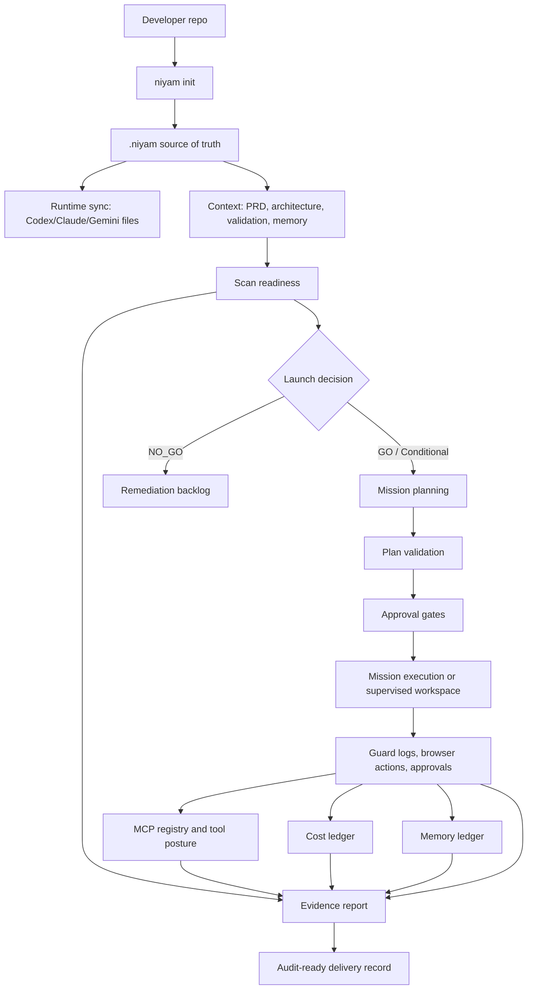

# Niyam Governance Developer Evaluation

Date: 2026-06-11

## Goal

Test Niyam as a real developer would use it while preparing a complex SaaS app goal: initialize governance, add product context, scan readiness, enforce guardrails, register tools, track memory and cost, supervise browser work, plan a mission, and generate evidence.

## Automated Validation

Command:

```bash
uv run pytest
```

Initial result:

- 552 passed
- 2 failed
- 91 warnings
- Duration: 351.39s

Initial failures found:

- `tests/test_evidence_extended.py::test_evidence_reports_exact_10_sections_and_11_schema_keys`
  - Current evidence Markdown emits `## 11. Appendix Summary`.
  - Test still expects `10. Appendix Summary`.
  - The runtime output and the test contract disagree.
- `tests/test_readiness_scoring.py::test_scoring_critical_secret_no_go`
  - Current reason: `Hard blocker triggered: Critical security finding detected (SEC002).`
  - Test expects the reason to include `critical secrets finding` or `secrets`.
  - The scanner blocks correctly, but the reason text lost category specificity.

After fixes:

- `uv run pytest`: 557 passed, 91 warnings in 413.51s.
- Focused post-telemetry validation: 62 passed, 68 warnings in 136.57s.

## Real Developer Workflow Tested

Temporary app workspace:

```text
/private/tmp/niyam-dev-eval.f0dAPA/complex-risky-app
```

Seed app:

```text
test-fixtures/apps/risky-vibe-app
```

Scenario:

```text
Build a multi-tenant AI workflow SaaS with auth, billing, organization roles,
background jobs, admin audit logs, a Next.js dashboard, API routes, and
Terraform-managed cloud deployment.
```

Commands exercised:

- `niyam init --profile startup-saas --runtime codex`
- `niyam context add`
- `niyam context refresh`
- `niyam doctor`
- `niyam policy validate`
- `niyam scan --profile enterprise --output json`
- `niyam scan --profile enterprise --output markdown`
- `niyam guard enable`
- `niyam guard careful`
- `niyam guard freeze src`
- `niyam guard run --capture-output`
- `niyam guard run --mode block --dry-run`
- `niyam guard logs`
- `niyam memory init`
- `niyam memory add`
- `niyam memory recall`
- `niyam mcp register`
- `niyam mcp approve`
- `niyam mcp risk-report`
- `niyam cost log`
- `niyam cost summary`
- `niyam workspace create`
- `niyam workspace browser-start`
- `niyam workspace browser-action`
- `niyam workspace request-approval`
- `niyam workspace approve`
- `niyam workspace evidence`
- `niyam mission ingest --no-ai`
- `niyam mission plan`
- `niyam mission show`
- `niyam mission validate-plan`
- `niyam mission explain`
- `niyam mission approve`
- `niyam evidence --include scan,guard,mcp,cost,memory,workspace`

## Results

Working:

- Init wrote a complete `.niyam/` workspace and synced Codex runtime files.
- Context add and refresh stored PRD context and generated architecture/validation context.
- Doctor passed with 0 errors.
- Enterprise scan returned `NO_GO`, score `27/100`, and detected secrets, missing lockfile, missing `.gitignore`, missing health endpoint, missing tests, missing CI, and AI placeholder risk.
- Guard enable/careful/freeze worked and regenerated Codex hooks.
- Guard observe redacted a fake API key in output and logs.
- Guard block dry-run classified `rm -rf .` as blocked without executing it.
- Memory init/add/recall worked.
- MCP register/approve/risk-report worked.
- Workspace Control Room created a high-risk browser session, logged browser actions, required approval for sensitive input, and exported evidence.
- Mission ingest created structured requirements.
- Mission planning attempted Codex, then fell back to a deterministic plan after runtime failure.
- Mission validate/show/explain/approve worked.
- Combined evidence report generated Markdown and JSON with scan, guard, MCP, memory, workspace, and cost data.

Issues found and fixed:

- `niyam policy validate` crashes:
  - `ImportError: cannot import name 'validate_policies' from niyam.policies.validator`
  - `niyam guard policy` uses `run_policy_validate`, so top-level `policy validate` is wired differently and broken.
  - Fixed by wiring `policy validate` to `run_policy_validate`.
- Scan and mission planning print ChromaDB telemetry errors:
  - `Failed to send telemetry event ClientStartEvent: capture() takes 1 positional argument but 3 were given`
  - This pollutes CLI output and should be disabled or handled.
  - Fixed by disabling Chroma anonymized telemetry and suppressing the telemetry logger in code-index paths.
- Evidence section numbering is inconsistent with one test contract:
  - Current report has 11 sections.
  - Failing test expects appendix at section 10.
  - Fixed by updating the test contract to section 10 cost/performance and section 11 appendix.
- Readiness hard-block reason is correct behaviorally but less precise than the test expects:
  - It says `Critical security finding detected`.
  - It should probably include the category, for example `Critical secrets finding detected`.
  - Fixed by making hard-block reasons category-aware.
- Mission fallback assigned the security review task to `designer` in the startup-saas profile.
  - Expected: `security-reviewer` when available, otherwise a backend/QA reviewer.
  - Fixed by choosing `security-reviewer`, then `qa-reviewer`, then `backend-specialist`.
- Cost tracking recorded tokens but estimated `$0.0000` for `gpt-5-codex`.
  - Pricing metadata is missing for that model.
  - Fixed by adding GPT-5-family defaults and merging new defaults into existing local pricing files.

Remaining product gaps:

- MCP approval updates approval state but does not capture approver/reason metadata.
- The existing `scripts/test-governance-e2e.sh` uses `rm -rf`, which violates the project denied-command policy.

## Functional Flow



## Recommendation

The core developer workflow is now green under the full automated suite. Remaining cleanup should focus on richer MCP approval metadata and rewriting `scripts/test-governance-e2e.sh` so it does not use policy-denied commands.
